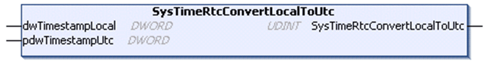

# SysTimeRtcConvertLocalToUtc

## Function Description

This function calculates the UTC (Coordinated Universal Time) from a local time considering the timezone setting of the runtime system. Both the UTC and the local time stamp indicate the number of seconds since January 1st, 1970 00:00:00.

## Graphical Representation

## I/O Variables Description

| Input | Type | Description |
| --- | --- | --- |
| dwTimestampLocal | DWORD | Local time stamp |

| Input/Output | Type | Description |
| --- | --- | --- |
| pdwTimestampUTC | DWORD | UTC calculated from the input. |

| Output | Type | Description |
| --- | --- | --- |
| SysTimeRtcConvertLocalToUtc | UDINT | Runtime system error code (refer to CmpErrors.library):  0 = no error detected |

EIO0000002944.03