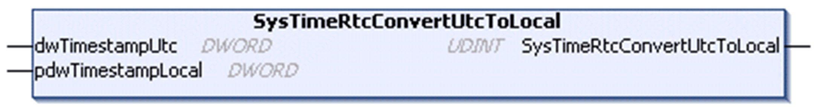

# SysTimeRtcConvertUtcToLocal

## Function Description

This function calculates the local time from the UTC (Coordinated Universal Time) considering the time zone setting of the runtime system. Both the UTC and the local time stamp indicate the number of seconds since January 1st, 1970 00:00:00.

## Graphical Representation

## I/O Variables Description

| Input | Type | Description |
| --- | --- | --- |
| dwTimestampUtc | DWORD | UTC time stamp |

| Input/Output | Type | Description |
| --- | --- | --- |
| pdwTimestampLocal | DWORD | Local time stamp calculated from the input. |

| Output | Type | Description |
| --- | --- | --- |
| SysTimeRtcConvertUtcToLocal | UDINT | Runtime system error code (refer to CmpErrors.library):  0 = no error detected |

EIO0000002944.03