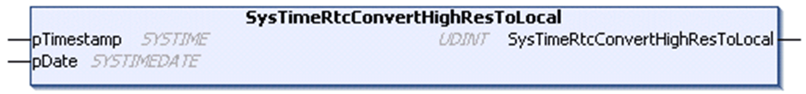

# SysTimeRtcConvertHighResToLocal

## Function Description

This function converts a high resolution time stamp value into the corresponding date and time in [SYSTIMEDATE](D-SE-0005796.html#D-SE-0005796) format considering the timezone settings of the runtime system. The value pTimestamp represents the UTC and is converted to the local time, which is provided on pDate.

## Graphical Representation

## I/O Variables Description

| Input/Output | Type | Description |
| --- | --- | --- |
| pTimestamp | SYSTIME | Time stamp to be converted. |
| pDate | [SYSTIMEDATE](D-SE-0005796.html#D-SE-0005796) | Local time calculated from pTimestamp. |

| Output | Type | Description |
| --- | --- | --- |
| SysTimeRtcConvertHighResToLocal | UDINT | Runtime system error code (refer to CmpErrors.library):  0 = no error detected |

NOTE: SYSTIME is an alias type based on the data type ULINT.

EIO0000002944.03