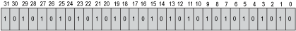

# Bit Organization for DWORD

## Bit Organization for DWORD

This figure shows the codage rule of the bit position in a DWORD. An example is given for the 16#AAAAAAAA corresponding to the value of 2863311530.

## Integer Data Types Description

This table shows the integer data types. Each of the different number types covers a different range types.

| Type | Lower limit | Upper limit | Memory space |
| --- | --- | --- | --- |
| `BYTE` | 0 | 255 | 8 Bit |
| `WORD` | 0 | 65535 | 16 Bit |
| `DWORD` | 0 | 4294967295 | 32 Bit |
| `LWORD` | 0 | 264-1 | 64 Bit |
| `SINT` | -128 | 127 | 8 Bit |
| `USINT` | 0 | 255 | 8 Bit |
| `INT` | -32768 | 32767 | 16 Bit |
| `UINT` | 0 | 65535 | 16 Bit |
| `DINT` | -2147483648 | 2147483647 | 32 Bit |
| `UDINT` | 0 | 4294967295 | 32 Bit |
| `LINT` | -263 | 263-1 | 64 Bit |
| `ULINT` | 0 | 264-1 | 64 Bit |

## REAL/LREAL Data Types Description

This table shows the `REAL`/`LREAL` data types. `REAL` and `LREAL` are called floating-point types. They are required to represent rational numbers.

| Type | Range | Resolution | Memory space |
| --- | --- | --- | --- |
| `REAL` uses 4 bytes | -3.402e+38...3.402e+38  (-2^128...2^128) | 1,175e-38  (2^-126) | 32 Bit |
| `LREAL` uses 8 bytes | -1.797e+308...1.797e+308  (-2^1024...2^1024) | 2,225e-308  (2^-1022) | 64 Bit |

NOTE: The support of data type `LREAL` depends on the target device. Please see in the corresponding documentation whether the 64 bit type `LREAL` gets converted to `REAL` during compilation (possibility with a loss of information) or persists.

EIO0000000096.09