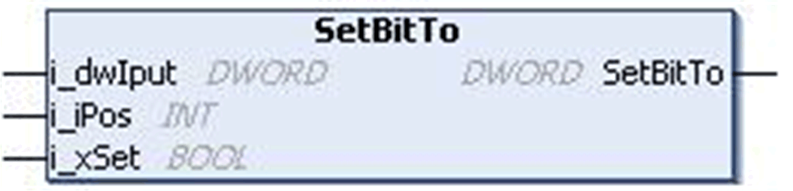

# `SetBitTo` Function

## Pin Diagram

This figure shows the pin diagram of the `SetBitTo` function:

## Functional Description

The `SetBitTo` function sets/resets (according to set) one bit specified by the bit in the given `DWORD` input. The bits are counted from low to high starting with 0.

The valid range is 0 to 31.

## Input Pin Description

This table describes the input pins of the `SetBitTo` function:

| Input | Data Type | Description |
| --- | --- | --- |
| `i_dwIput` | `DWORD` | Input value  Range: 0...4294967295 |
| `i_iPos` | `INT` | Bit position  Range: 0...31 |
| `i_xSet` | `BOOL` | TRUE: Set  FALSE: Reset. |

## Output Pin Description

This table describes the output pins of the `SetBitTo` function:

| Output | Data Type | Description |
| --- | --- | --- |
| `SetBitTo` | `DWORD` | Output value  Range: 0...4294967295 |

## Limitations

If the `i_iPos` input is not within the valid range, the input will be interpretated in modulo mode.

EIO0000000096.09