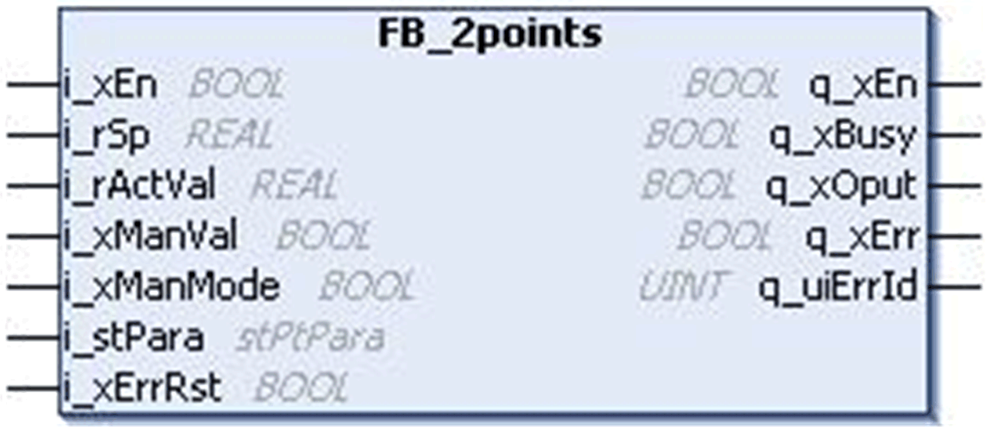

# `FB_2points` Function Block

## Pin Diagram

This figure shows the pin diagram of the `FB_2points` function block:

## Functional Description

The `FB_2points` function block provides a 2 point transfer function based on hysteresis input.

EIO0000000096.09