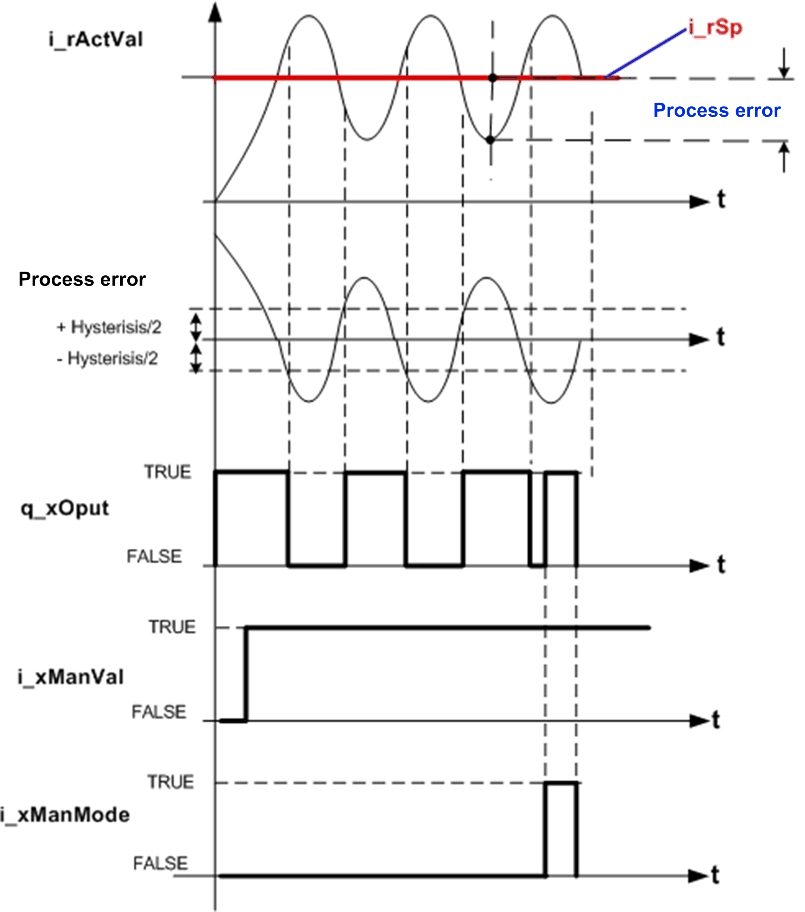
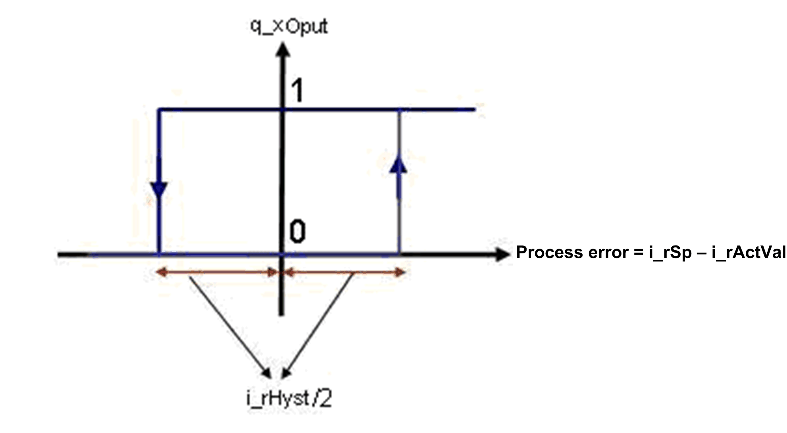

# Operating Modes

## Automatic Mode

In automatic mode (`i_xEn` is TRUE and `i_xManMode` is FALSE), if the calculated process error is greater than 50% of the hysteresis in the positive direction, then `q_xOput` is TRUE.

`q_xOput` is reset only if the calculated process error goes below 50% of hysteresis in negative direction.

Process error = Setpoint value – Actual value.

## Manual Mode

If `i_xManMode` is TRUE regardless of the current inputs, the output is set to the state of `i_xManVal`.

This figure shows the timing diagram for the `FB_2points` function block.

## Mode Timing Diagram

This figure shows the transfer function for the `FB_2points` function block.

## Detected Error State

An invalid parameter at the function block inputs results in a detected error and the corresponding detected error ID is generated.

During the error detected state, the output value is set to zero. Detected error can be reset only through rising edge of `i_xErrRst` input.

The output `q_xBusy` is TRUE, whenever the function block is enabled and when there is no detected error.

EIO0000000096.09