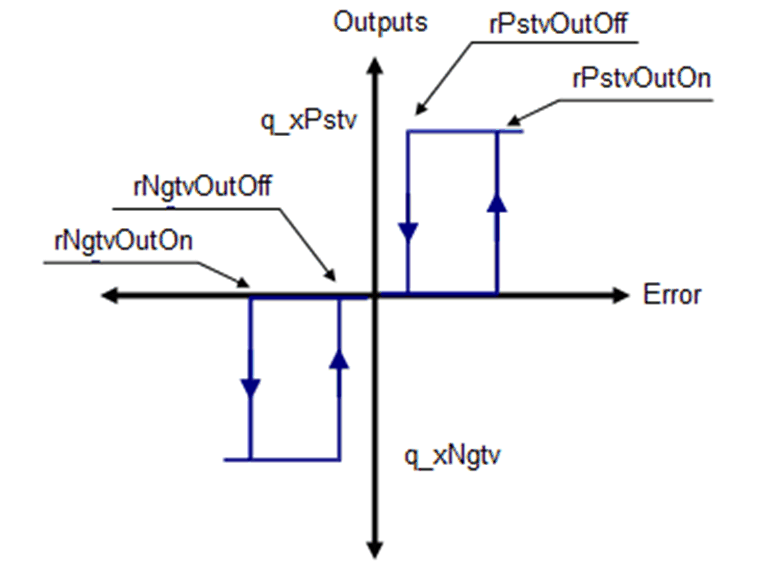
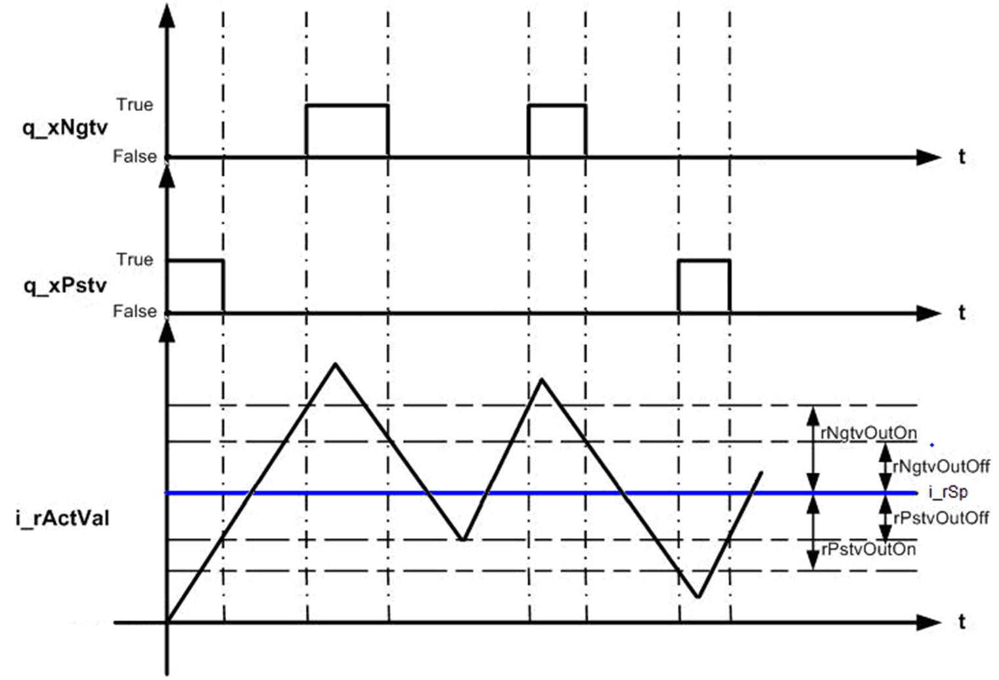

# Operating Modes

## Automatic mode

This function block checks the value of process error (set point - actual value).

If the process error is positive and more than the upper threshold value for positive side `rPstvOutOn`, it sets the `q_xPstv` output signal.

`q_xPstv` output is reset if the process error decreases below the lower threshold value for positive side `rPstvOutOff`.

If process error is negative, `q_xNgtv` output signal is set upon overshooting upper threshold value for negative side `rNgtvOutOn`.

`q_xNgtv` is reset upon decreasing below lower threshold value for negative side `rNgtvOutOff`.

## Manual Mode

The function block output is set manually according to the value of the `i_iManVal` input pin.

If

`i_iManVal` >= 1 then `q_xPstv` = TRUE, `q_xNgtv` = FALSE.

`i_iManVal` <= -1 then `q_xPstv` = FALSE, `q_xNgtv` = TRUE.

Else

`q_xPstv` = FALSE, `q_xNgtv` = FALSE

This figure shows the transfer function for the `FB_3points` function block:

## Timing Diagram

This figure shows the timing diagram for the `FB_3points` function block:

## Detected Error State

An invalid parameter at the function block inputs results in a detected error and corresponding detected error ID is generated.

During the error detected state the output values are set to zero. Detected error can be reset only through rising edge of `i_xErrRst` input.

The output `q_xBusy` is TRUE, whenever the function block is enabled and when there is no detected error.

EIO0000000096.09