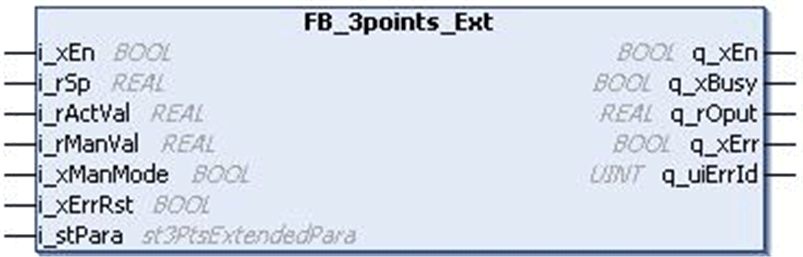

# `FB_3points_Ext` Function Block

## Pin Diagram

This figure shows the pin diagram of the `FB_3points_Ext` function block:

## Functional Description

The `FB_3points_Ext` function block provides a 3-point transfer element in the functional diagram.

This function block is an extension for `FB_3points` function block. It produces a control output `q_rOput` in the form of 3-point hysteresis loop. The output depends upon the process error and the gain and offset value that are given by the user.

EIO0000000096.09