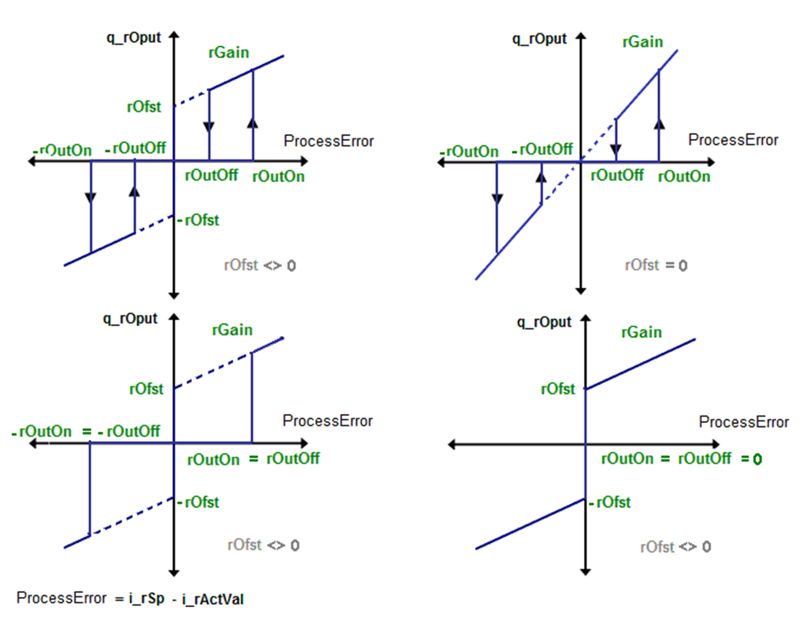
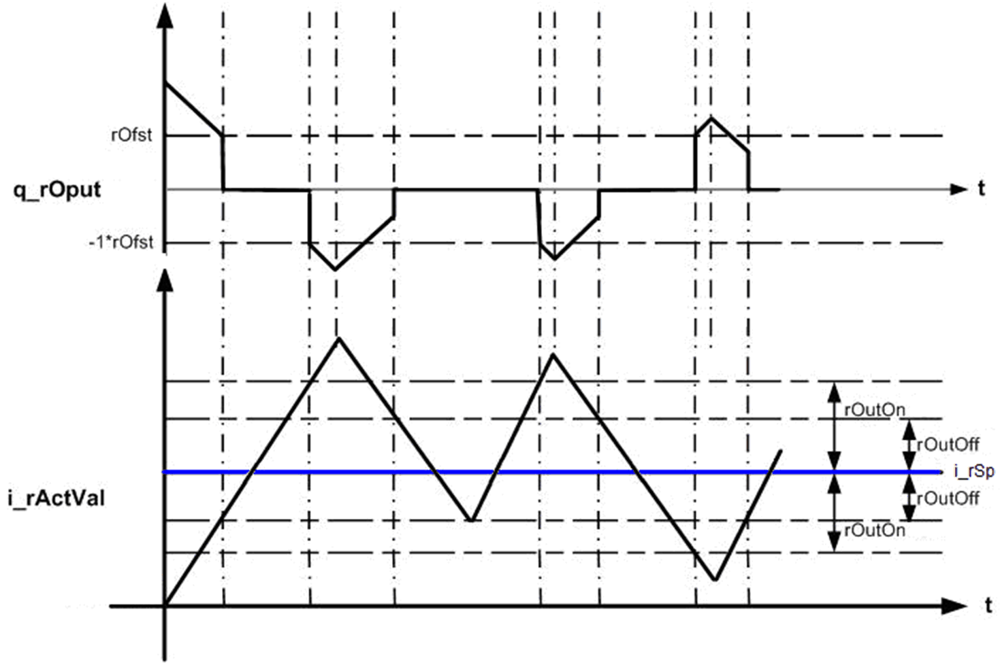

# Operating Modes

## Automatic Mode

This function block checks the value of process error (difference between set point and actual value). If the process error is positive and greater than the upper threshold value `rOutOn`, it calculates the control output as below,

`q_rOput` = Process error x `rGain` + `rOfst`

If the process error decreases below the lower threshold value `rOutOff`, it resets the control output to zero.

Similarly if process error is negative, and its absolute value is more than upper threshold value `rOutOn`, it calculates the control output as below,

`q_rOput` = Process error x `rGain` - `rOfst`

`q_rOput` is reset to zero if absolute value of process error becomes less than lower threshold value `rOutOff`.

## Manual Mode

The function block output is set manually as according to the value of input pin `i_rManVa`:.

| IF | AND IF | THEN |
| --- | --- | --- |
| `Abs(i_rManVal`) < 1 | - | `q_rOput` = 0.0 |
| `Abs(i_rManVal`) >= 1 | `rE` > 0 | `q_rOput` = `rE` x `rGain` + `rOfst` |
| `Abs(i_rManVal`) >= 1 | `rE` < 0 | `q_rOput` = `rE` x `rGain` - `rOfst` |
| `Abs(i_rManVal`) >= 1 | `rE` = 0 | `q_rOput` = 0.0 |
| **rE** = `i_rSp` - `i_rActVal`  **Abs()** Absolute value function. | | |

This figure shows the transfer function for the `FB_3points_Ext` function block:

## Timing Diagram

This figure shows the timing diagram for the `FB_3points_Ext` function block:

## Detected Error State

An invalid parameter at the function block input results in a detected error state and a corresponding detected error ID is generated.

During the error detected state the output values are set to zero. Detected error can be reset only through rising edge of `i_xErrRst` input.

The output `q_xBusy` is TRUE whenever the function block is enabled and when there is no detected error.

EIO0000000096.09