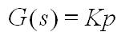
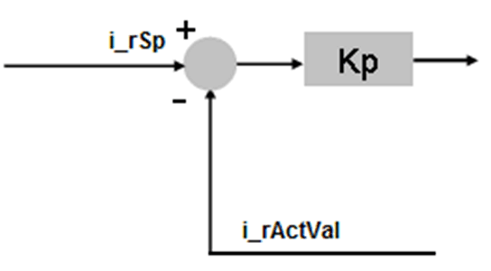
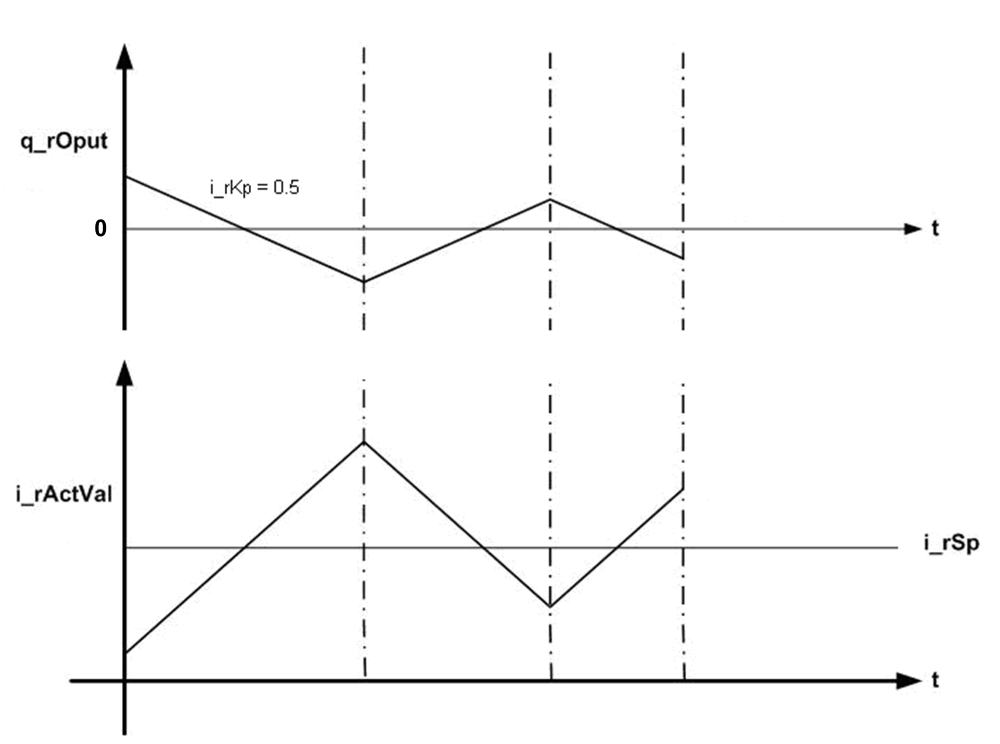

# Operation Modes

## Automatic Mode

This function block provides the proportional response i.e. the output is process error times the gain.

This equation shows the transfer function:

Where:

| Kp | = Proportional gain |

| q\_rOput | = G(s) \* Process error |

## Manual Mode

The `q_rOput` function block output is set equal to `i_rManVal`.

This figure shows the function diagram for the `FB_P` function block

## Timing Diagram

This figure shows the timing diagram for the `FB_P` function block

## Detected Error State

An invalid parameter at the function block inputs results in detected error and corresponding detected error ID is generated.

During detected error state, the output values are set to zero. Detected error can be reset only through rising edge of `i_xErrRst` input.

The output `q_xBusy` is TRUE whenever the function block is enabled and there is no detected error.

EIO0000000096.09