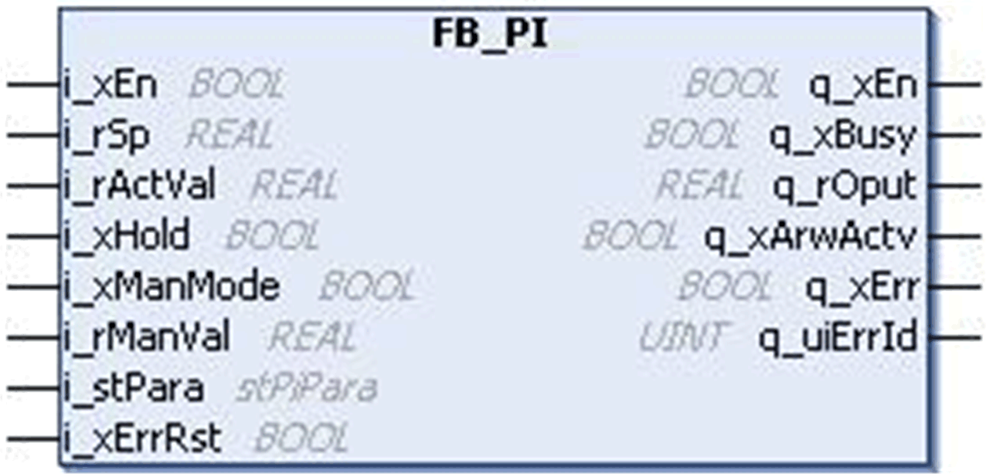
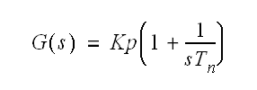
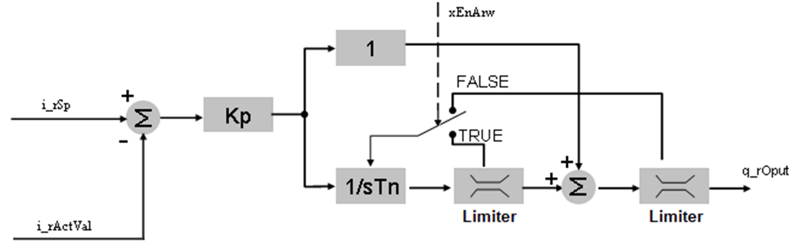

# `FB_PI` Function Block

## Pin Diagram

This figure shows the pin diagram of the `FB_PI` function block:

## Functional Description

The `FB_PI` function block is a standard PI function block with manual tuning, hold function, and anti reset wind-up.

The PI controller generates a control output based on the process error in the system (Process error = Set Point – Actual Value). Using the setting of function block parameters, control output can be tuned to reduce the process error.

The proportional and integral value for the process calculated continuously based on the actual value, set point and input parameters. The function block also limits the control output based on limit settings.

## Transfer Function

The following equation is the transfer function for the `FB_PI` function block:

Where:

| Kp | = Proportional gain. |
| sTn | = Integral time |

## Functional Diagram

This figure shows the functional diagram of the `FB_PI` function block:

This function block is used to control the Closed Loop processes with continuous input and output variables.

## Detected Error State

An invalid parameter at the function block inputs results in a detected error and a corresponding detected error ID is generated.

During the error detected state, the output value is set to zero.

Detected error can be reset only through rising edge of `i_xErrRst` input. The output `q_xBusy` is TRUE, whenever the function block is enabled and when there is no detected error.

EIO0000000096.09