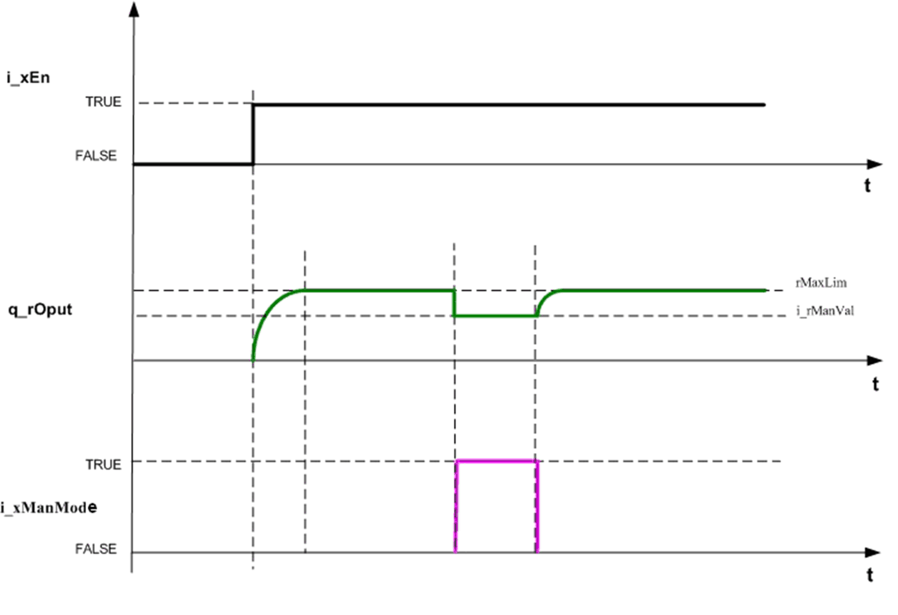
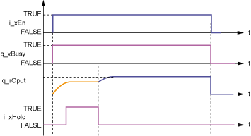

# Input Pin Description

## Input Pin Table

This table describes the input pins of the `FB_PI` function block:

| Input | Data Type | Description |
| --- | --- | --- |
| `i_xEn` | `BOOL` | TRUE: Enables the function block  FALSE: Disables the function block |
| `i_rSp` | `REAL` | Set point value  Range: ±3.4e+38 |
| `i_rActVal` | `REAL` | Actual value  Range: ±3.4e+38 |
| `i_rManVal` | `REAL` | Manual value  Range: ±3.4e+38  (Optional) |
| `i_xManMode` | `BOOL` | Manual value  (Optional) |
| `i_xHold` | `BOOL` | Hold  (Optional) |
| `i_xErrRst` | `BOOL` | Reset for detected error (rising edge reset detected error)  (Optional) |
| `i_stPara` | `STRUCT stPiPara` | Structure parameter  (Refer to the [stPiPara description](D-SA-0026159.html#D-SA-0026159).) |

## `i_xManMode`

`i_xManMode` decides the manual mode of the `FB_PI` function block.

If the function block is enabled and manual is set to TRUE, then the function block will set the manual value (`i_rManVal`) as the PI output and stops the PI algorithm as shown in block diagram function block in manual mode.

If the auto mode is enabled, then PI Algorithm executes continuously.

This figure shows the time diagram of the function block in manual mode:

## `i_xHold`

`i_xHold` will hold the PI output at current level.

If this input is TRUE, then the PI output will be maintained at last value and internal calculations of PI algorithm will be stopped as shown in block diagram function block on hold.

If this input is FALSE, then PI algorithm is executed cyclically. The new PI output will be calculated from the last value.

Time diagram of the function block on hold:

EIO0000000096.09