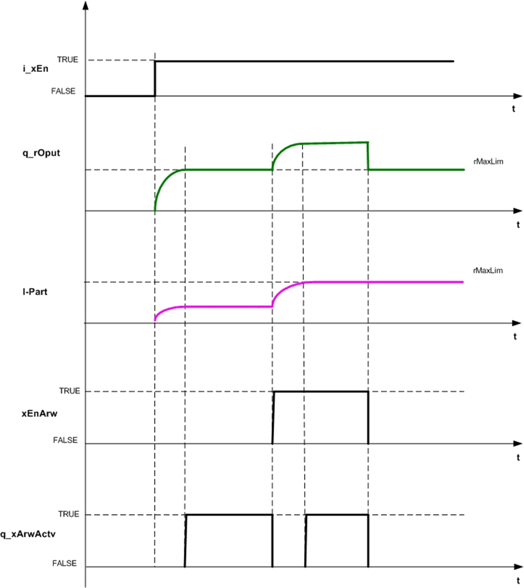

# Structure Used

## stPiPara

| Structure Element | Type | Description |
| --- | --- | --- |
| tCyclTime | TIME | Task cycle time  Range: 10 ms...60 s |
| xEnArw | BOOL | Enable anti reset wind-up |
| tTn | TIME | Integral action time  Range: 1...1e32 ms |
| rKp | REAL | Proportional gain Value  Range: ±3.4e+38 |
| rMaxLim | REAL | Maximum Output Limit  Range: ±3.4e+38 |
| rMinLim | REAL | Minimum Output Limit  Range: ±3.4e+38 |

## `tCyclTime`

`tCyclTime` is the time between the two executions of the function block. If the task is assigned as cyclic, then it is equal to the task cycle time of the cyclic task.

## `xEnArw`

`xEnArw` will enable anti reset wind-up (ARW) operation.

If FALSE, hold the integral part if the entire control output reaches a limit.

If TRUE, the function block holds the integral part only if the integral part reaches a limit. The output is equal to the sum of limit value and proportional part if integral part reaches a limit as shown in block diagram function block on enable ARW.

This figure shows the function block on Enable ARW mode:

## `tTn`

Integral time for PI loop

## `rKp`

Proportional gain for PI loop

## `rMaxLim`

Output greater than this limit is limited to `rMaxLim` value.

## `rMinLim`

Output less than this limit is limited to `rMinLim` value.

NOTE: If the `rMinLim` is greater than 0 then PI then operation starts from the `rMinLim` value.

EIO0000000096.09