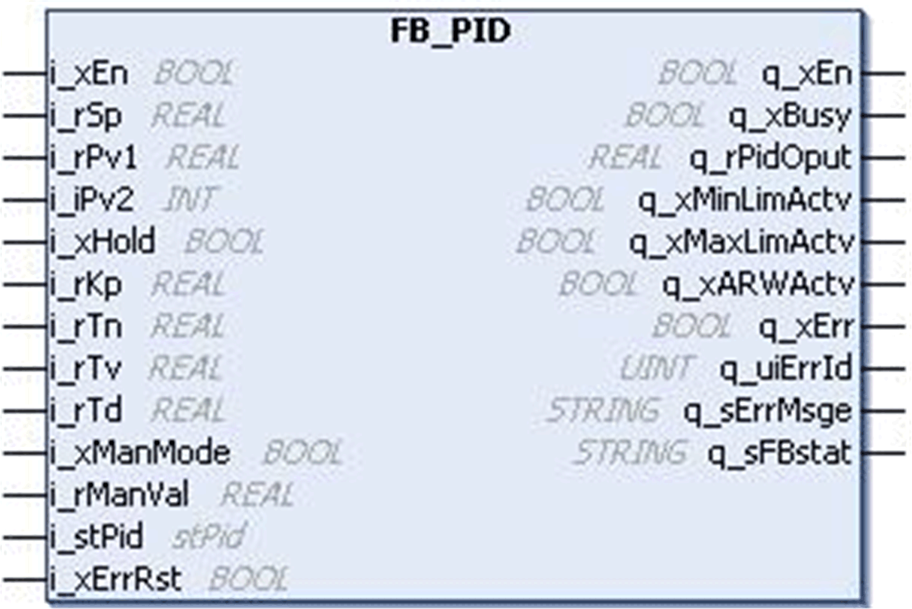
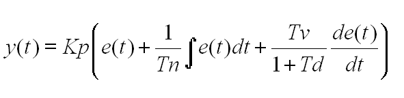
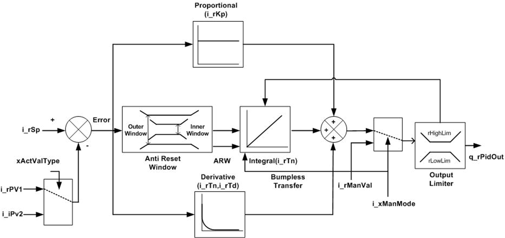
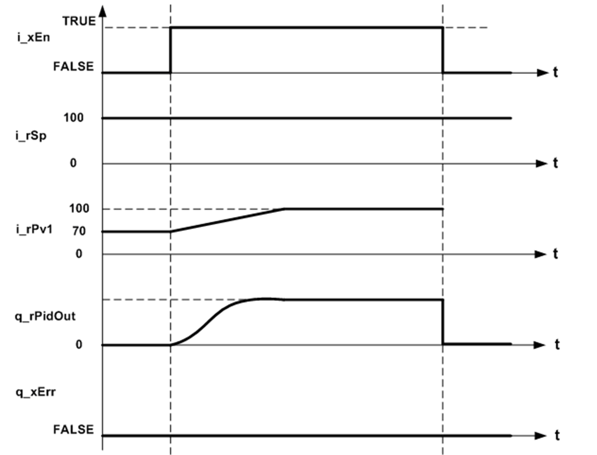
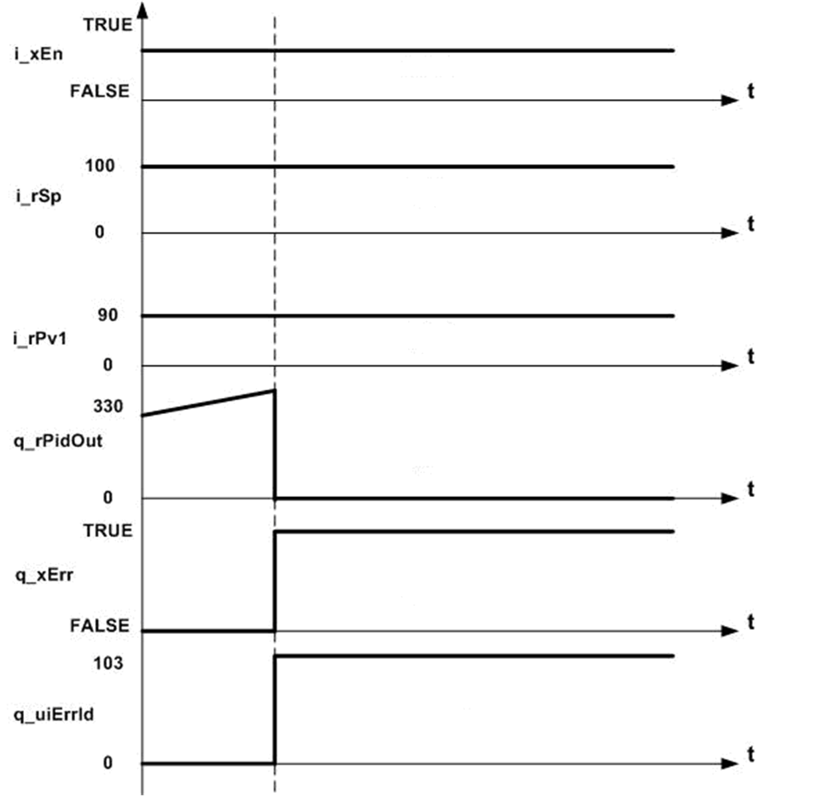

# `FB_PID` Function Block

## Pin Diagram

This figure shows the pin diagram of the `FB_PID` function block:

## Functional Description

The `FB_PID` function block is a standard PID function block with manual tuning, hold function, bumpless transfer and damping time for derivative action.

This function block provides following features:

* Different modes such as P, PI, PD, and PID.

* Manual mode operation to control the PID output in manual mode.

* Anti reset wind-up to avoid the saturation or wind-up in integral action: If the control variable reaches actuator limit, process error will continue to integrate very large integral term is called as windup.

* Damping time (Td) to filter the overshoot due to derivative action.

* Bump less transfer is activated when mode changes from manual to auto.

  Bump less transfer avoids sudden change in PID output when mode changes.

* Detected error status is generated by function block to display detected errors.

* Inner and outer window functions are used in integral calculations.

  If absolute value of process error is less than inner window then integral part is scaled with a factor [ABS (err)/Inner Window].

  This minimizes the overshoot in the PID output.

  If absolute value of process error is greater than inner window and less than outer window then normal integral calculations are done.

  If absolute value of process error is greater than outer window then anti reset windup is active and integral output will hold the last value.

## PID Output

The following equation shows the PID output:

Where:

| y (t) | = PID Output |
| Kp | = Proportional gain |
| Tn | = Integral time |
| Tv | = Derivative time |
| Td | = Filter time for derivative |
| e (t) | = Process error between set point and feedback value. |

## Schematic Diagram

This figure shows the block diagram for the `FB_PID` function block:

## Normal Behavior Diagram

This figure shows normal behavior diagram of the `FB_PID` function block:

## Detected Error Diagram

This figure shows the `FB_PID` function block diagram with detected error:

EIO0000000096.09