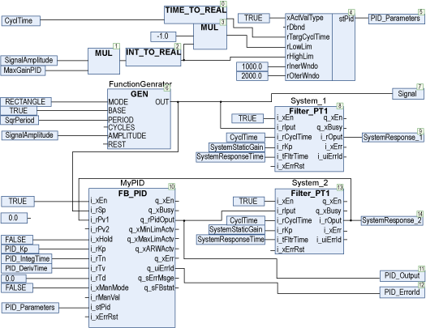
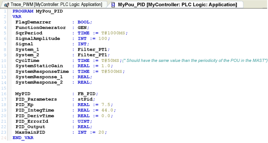
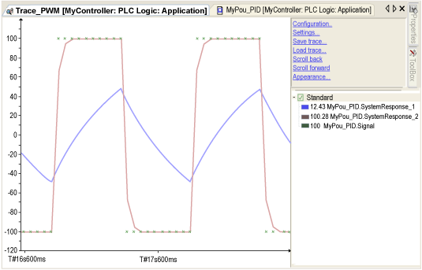
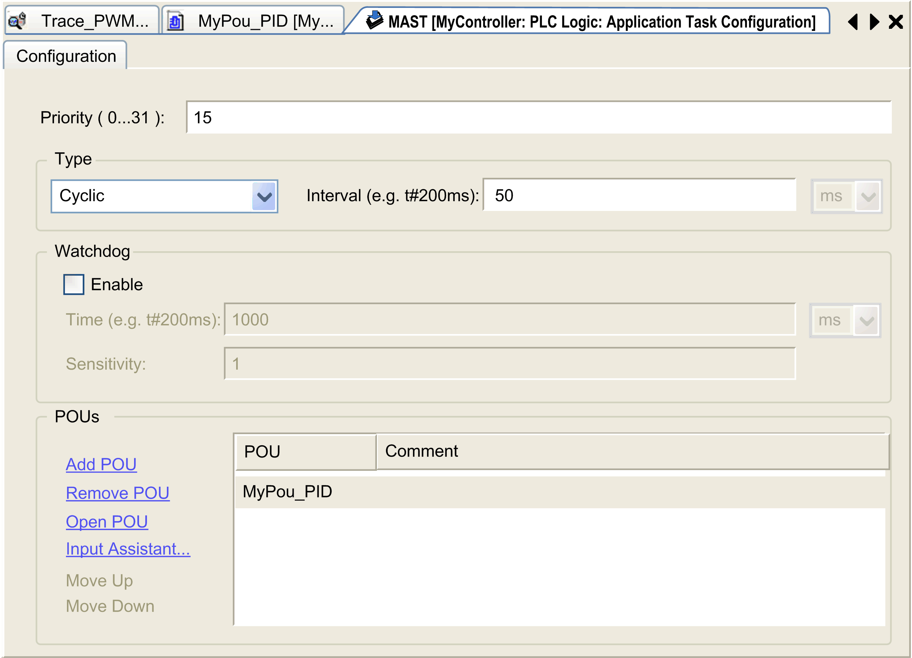
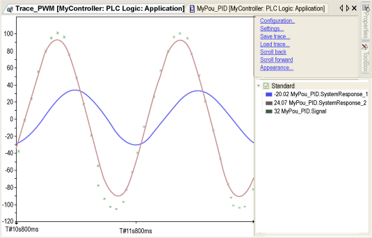
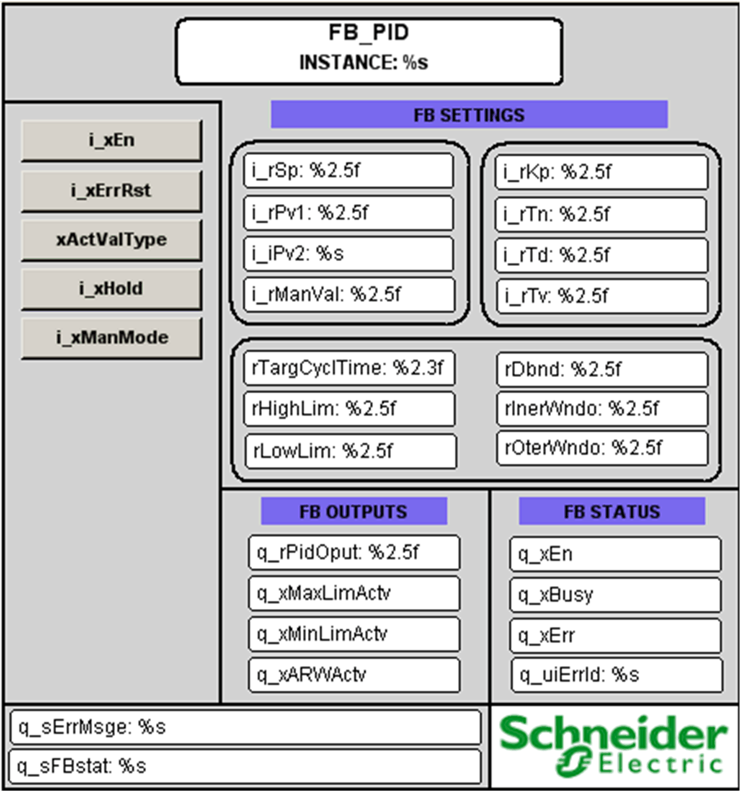

# Instantiation and Usage Example

## Instantiation and Usage Example

This figure shows an instance of the `FB_PID` function block:

* A square signal is generated using the GEN, key parameters are `SqrPeriod` and `SignalAmplitude`.
* The system to control is a simple first order filter, key parameters are `SystemResponseTime` and `SystemStaticGain`.
* A trace is done in open loop `SystemResponse_1` and in closed loop using `FB_PID` function block.

Data of this example are:

Using the previous setting, the setpoint/open loop/closed loop answer is:

The input `i_tCyclTime` of the first order filters System\_1 and System\_2 (dataCyclTime) must have exactly the same value as the period of the POU in the MAST, here 50 milliseconds.

When the GEN MODE is changed from RECTANGLE to SINUS with the same other parameters, the Sinus answer is:

This figure shows the visualization of the `FB_PID` function block:

## Detected Error State

This table describes some general detected errors:

| Issue | Cause | Solution |
| --- | --- | --- |
| Detected error state | Invalid input parameter | Enter valid parameter, then reset detected error |

NOTE: If the function block is disabled, outputs are set to zero.

EIO0000000096.09