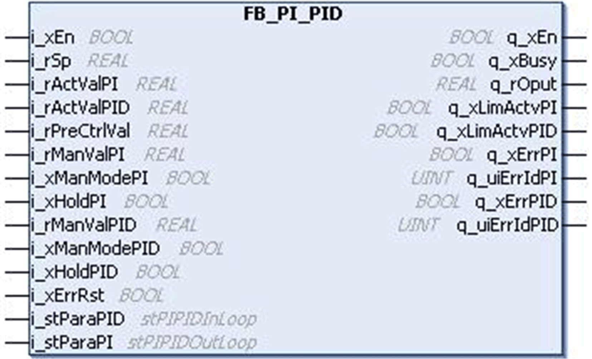

# `FB_PI_PID` Function Block

## Pin Diagram

This figure shows the pin diagram of the `FB_PI_PID` function block:

## Functional Description

The `FB_PI_PID` function block provides a cascaded operation of `FB_PI`, `FB_Limiter` and `FB_PID`.

This function block consists of a PI, a control limiter, and a PID element.

EIO0000000096.09