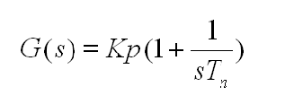
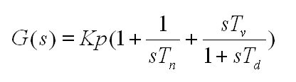
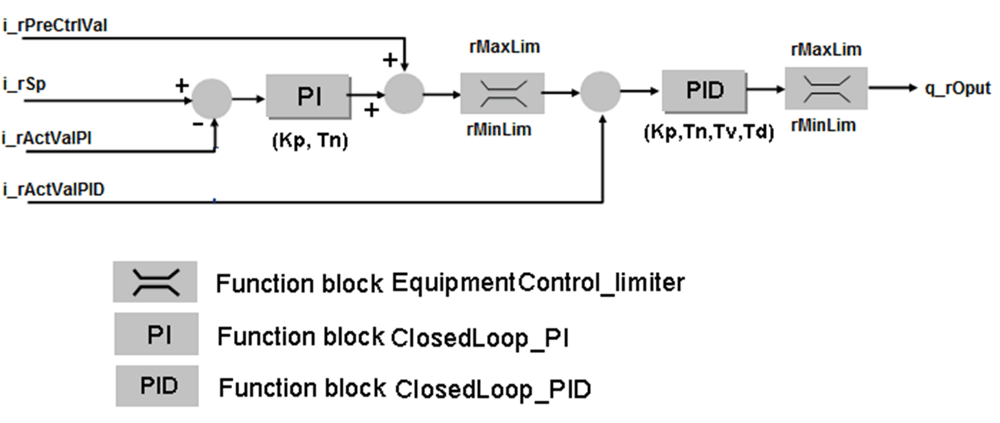
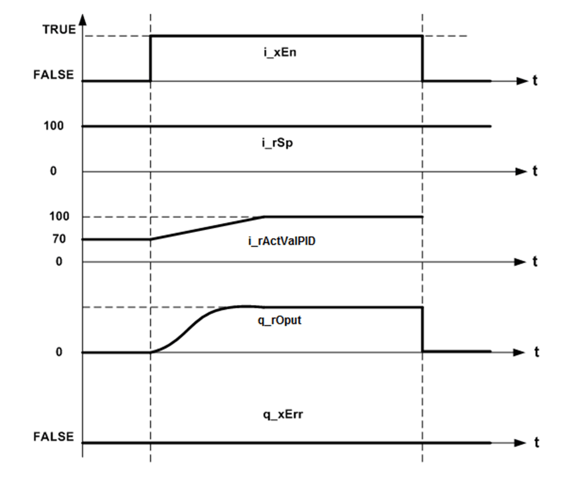

# Operation Modes

## Automatic Mode

The function block calculates the PI response for set point `i_rSp` and outer loop actual value `i_rActValPI`. This PI response added to pre control value `i_rPreCtrlVal` and limited by maximum and minimum threshold inputs, serves as set point to inner PID loop.

The inner loop calculates a PID response with `i_rActValPID` as the inner loop actual value.

This equation shows the transfer function of PI element:

Where:

| Kp | = Proportional gain |
| Tn | = Integral time |

This equation shows the transfer function of PID element:

Where

| Kp | = Proportional gain |
| Tn | = Integral time |

Automatic mode:

| Td | = Derivative time |
| Tv | = Filter time |

## Manual Mode

The PI loop and the PID loop can be setup individually in manual modes using input pins `i_xManModePI` and `i_xManModePID` respectively. In manual mode, PI loop output and PID loop outputs are substituted by values at input pins `i_rManValPI` and `i_rManValPID` respectively.

This figure shows the transfer function for `FB_PI_PID` function block

## Timing Diagram

This figure shows the timing diagram for the `FB_PI_PID` function block

## Detected Error State

An invalid parameter at the function block inputs results in a detected error and a corresponding detected error ID is generated.

During the error detected state the output values are set to zero.

Detected error can be reset only through rising edge of `i_xErrRst` input.

The output `q_xBusy` is TRUE whenever the function block is enabled and when there is no detected error.

EIO0000000096.09