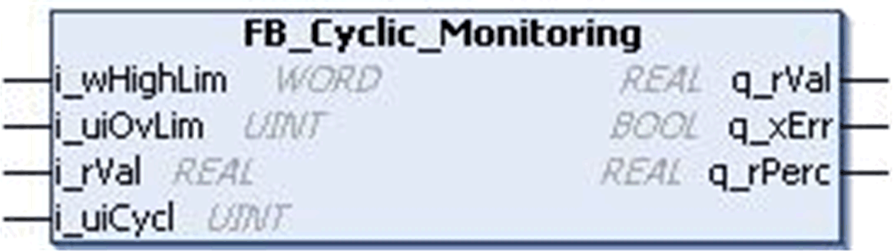
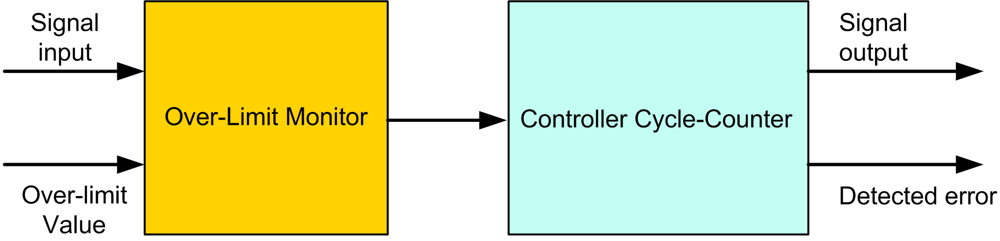
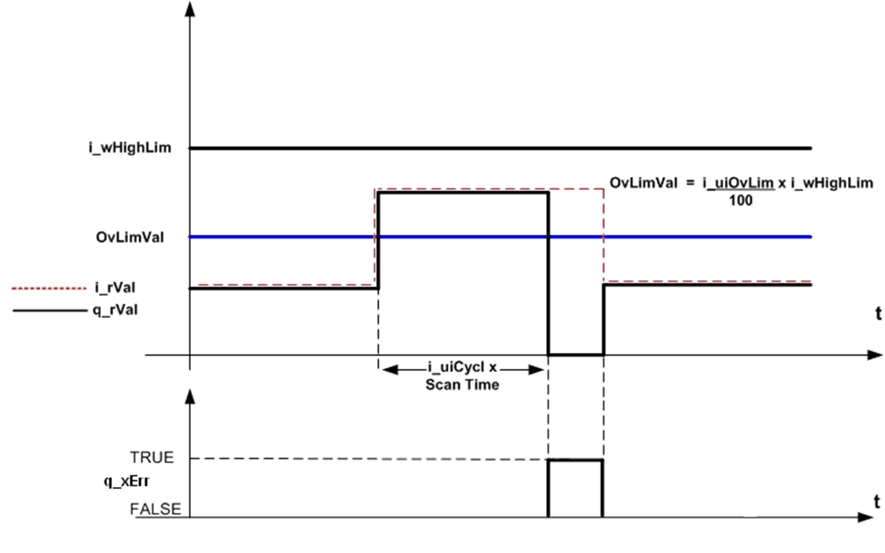

# `FB_Cyclic_Monitoring` Function Block

## Pin Diagram

This figure shows the pin diagram of the `FB_Cyclic_Monitoring` function block:

## Functional Description

The `FB_Cyclic_Monitoring` function block monitors an input signal for a maximum value (percentage of the absolute maximum value), over a pre-defined number of controller cycles before an inoperable over-limit is detected.

This function block is used to monitor a real input signal and to transfer the input signal to the output only if the input is within limits. It causes the input value to remain above a predefined limiting value for more than a predefined number of consecutive cycles.

In normal operation, the input signal is transferred to the output based on following conditions

* If the input signal is less than or equal to over-limit (%) of high limit.
* If the input signal is exceeding the high limit for “n” number of consecutive cycle which is less than cycle input.

## Timing Diagram

This figure shows the timing diagram for the `FB_Cyclic_Monitoring` function block:

## Detected Error State

If the input signal is exceeding over-limit (%) of high limit for n number of cycle which is greater or equal to cycle input, then output is set to zero and detected error output is set to TRUE. The detected error is reset automatically if the input signal is within the limit.

EIO0000000096.09