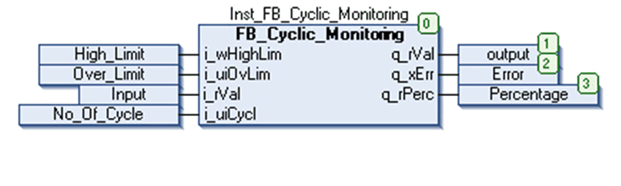

# Instantiation and Usage Example

## Instantiation and Usage Example

This figure shows an instance of the the `FB_Cyclic_Monitoring` function block:

## Example

This table shows and example for the `FB_CyclicMonitoring` function block operation:

| Example | Inputs | Outputs | Remarks |
| --- | --- | --- | --- |
| 1 | `i_wHighLim` = 200,  `i_uiOvLim` = 50,  `i_rVal` = 40,  `i_uiCycle` = 10 | `q_rVal` = 40,  `q_rPerc` = 20,  `q_xErr` = FALSE | Input value (`i_rVal`) is less than or equal to calculated over limit value (That is [(`i_uiOvLim/100`) x `i_wHighLim`]).  Output: Input `i_rVal` is assigned to output `q_rVal` & `q_xErr` output is FALSE. |
| 2 | `i_wHighLim` = 200,  `i_uiOvLim` = 50,  `i_rVal` = 110,  `i_uiCycle` = 10 | `q_rVal` = 110  `q_rPerc` = 55  `q_xErr` = FALSE | Input value (`i_rVal`) is greater than calculated over limit value (That is [(`i_uiOvLim/100`) x `i_wHighLim`]) and, **completed scan cycles are less than set no of cycles**.  Output: Input `i_rVal` is assigned to output `q_rVal` & `q_xErr` output is FALSE. |
| 3 | `i_wHighLim` = 200,  `i_uiOvLim` = 50,  `i_rVal` = 110,  `i_uiCycle` = 10 | `q_rVal` = 0  `q_rPerc` = 55  `q_xErr` = TRUE | Input Value (`i_rVal`) is greater than calculated over limit value (That is [(`i_uiOvLim/100`) x `i_wHighLim`)] and **completed scan cycles are equal to or greater than set no of cycles**.  Output: Output `q_rVal` is equal to zero and `q_xErr` output is TRUE. |

## Detected Error state

This table shows some general issues and their solution:

| Issue | Cause | Solution |
| --- | --- | --- |
| Detected error state | Input value(`i_rVal`) is not within the over limit (%) of `i_wHighLim` for n number of cycles | Input value (`i_rVal`) less than Over Limit value automatically resets detected error. |

EIO0000000096.09