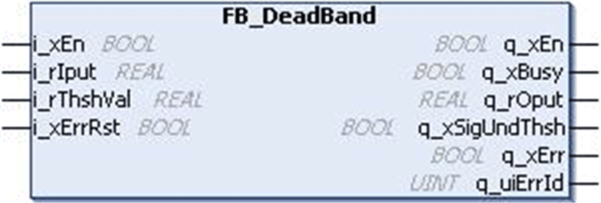
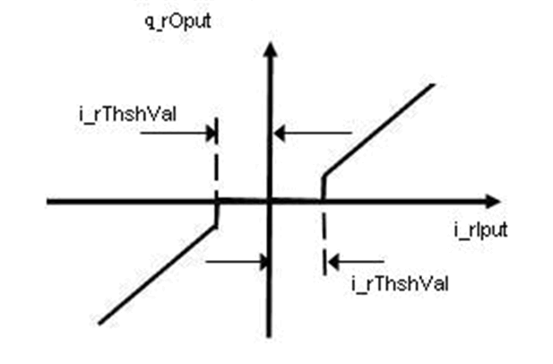
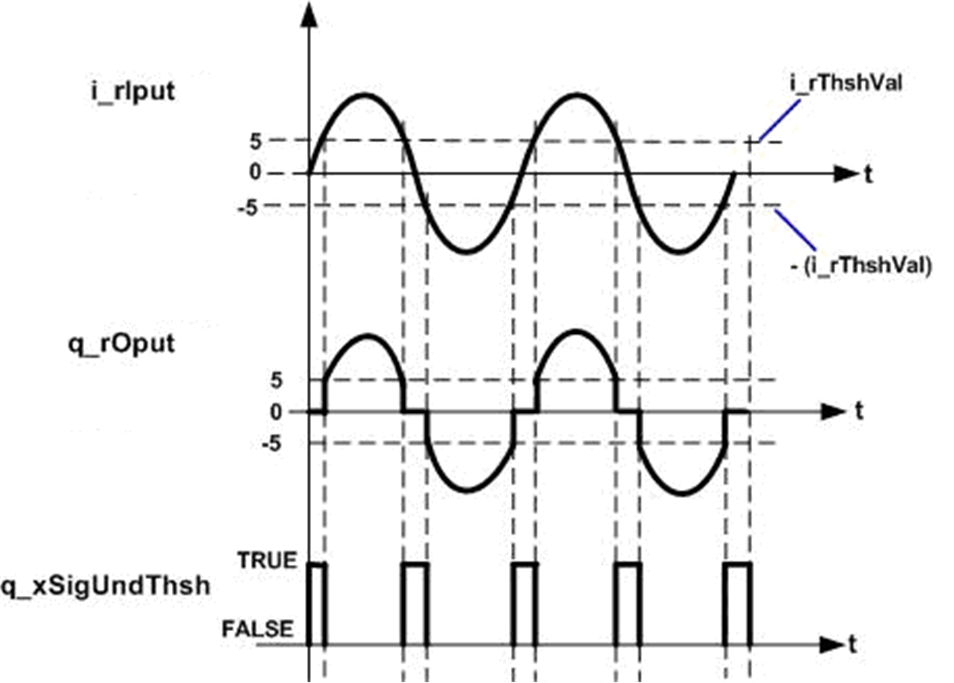

# `FB_DeadBand` Function Block

## Pin Diagram

This figure shows the pin diagram of the `FB_DeadBand` function block:

## Functional Description

The `FB_DeadBand` function block is a Deadband function block which allows the input to pass on to the output only if the input is greater than the Deadband limit.

This function block suppresses small amplitude oscillations that are caused by noise, quantization or parameter calculation. It suppresses an input signal if it is within the threshold as shown in transfer function figure below.

With reference to the timing diagram:

* If the `i_rIput` is lower than the defined threshold range, `q_rOput` is set to zero and `q_xSigUndThsh` is TRUE.
* If the input value (`i_rIput`) greater or equal to the threshold range, `q_rOput` is equal to the `i_rIput` value.

The `q_xEn` is TRUE as long as `i_xEn` is TRUE regardless of the detected error.

This figure shows the transfer function for `FB_DeadBand` function block:

## Timing Diagram

This figure shows the timing diagram for `FB_DeadBand` function block:

## Detected Error State

An invalid parameter at the function block inputs results in a detected error and corresponding detected error ID is generated. During the error detected state, the output value is set to zero.

The detected error can be reset only through rising edge of `i_xErrRst` input.

The `q_xBusy` is TRUE, whenever the function block is enabled and when there is no detected error.

EIO0000000096.09