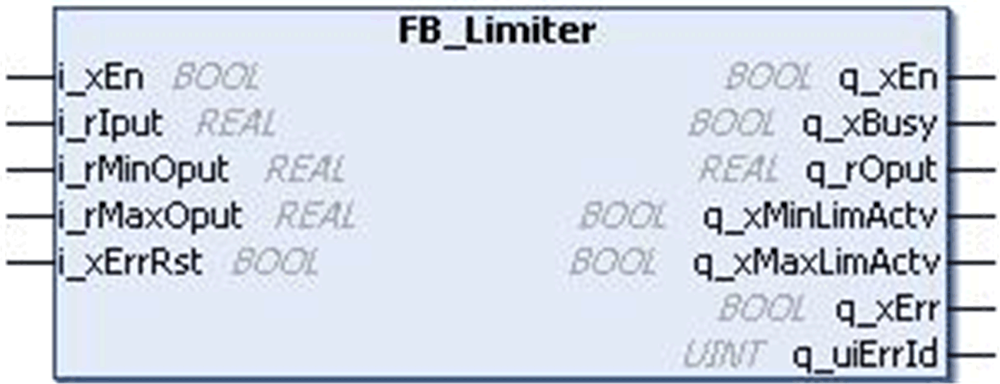
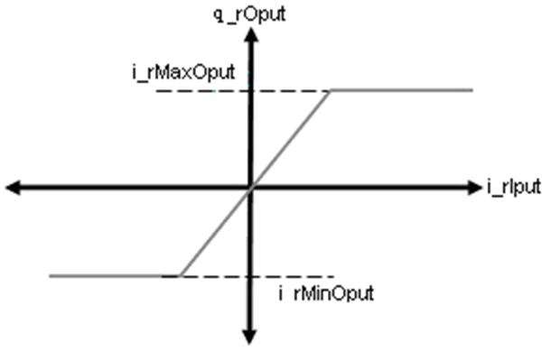
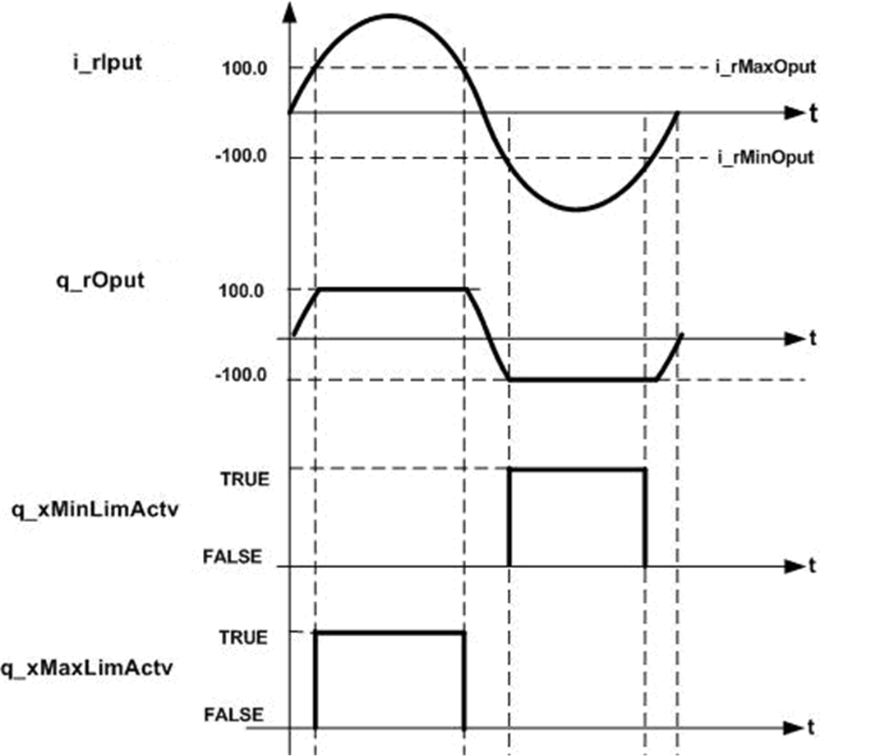

# `FB_Limiter` Function Block

## Pin Diagram

This figure shows the pin diagram of the `FB_Limiter` function block:

## Functional Description

The `FB_Limiter` function block is a limiter function block to limit an input signal within a defined range.

The input signal is limited to a defined range based on the `i_rMaxOput` and `i_rMinOput` as shown in the transfer function figure below.

If the input exceeds the upper or lower limit, the output is limited to maximum or minimum values respectively.

With reference to the timing diagram below:

* If the input is within the defined range, the output is equal to input value.
* If input value exceeds the maximum limit, the output is limited to maximum output value.
* Similarly, if the input goes below the minimum output value, the output is limited to the minimum output value.
* If the function block limits the output, then `q_xMinLimActv` or `q_xMaxLimActv` is TRUE, based on the type of limit.

The `q_xEn` is TRUE as long as `i_xEn` is TRUE, regardless of detected error.

This figure shows the transfer function of the `FB_Limiter` function block:

## Timing Diagram

This figure shows the timing diagram of the `FB_Limiter` function block:

## Detected Error State

An invalid parameter at the function block inputs results in detected error, and a corresponding detected error ID will be generated.

During a detected error state, the output will be set to zero.

Detected error can be reset only through the rising edge of `i_xErrRst` input. The output `q_xBusy` is TRUE whenever the function block is enabled and there is no detected error.

EIO0000000096.09