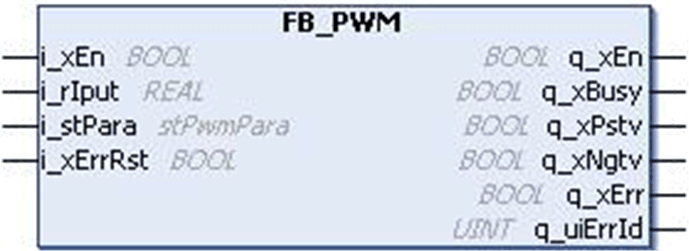
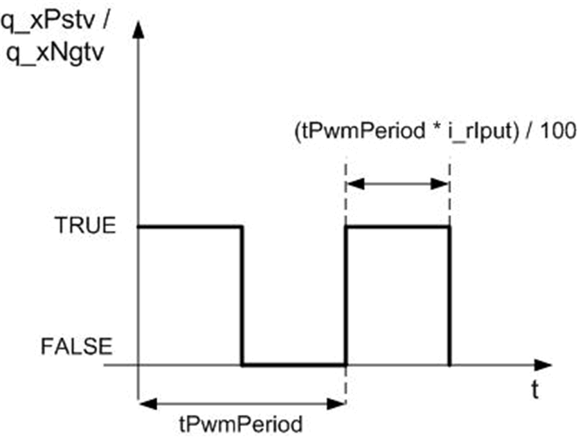
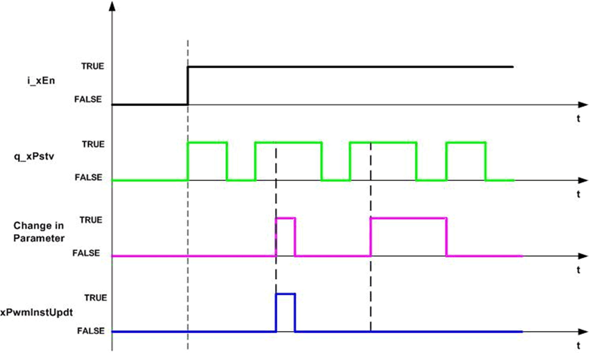
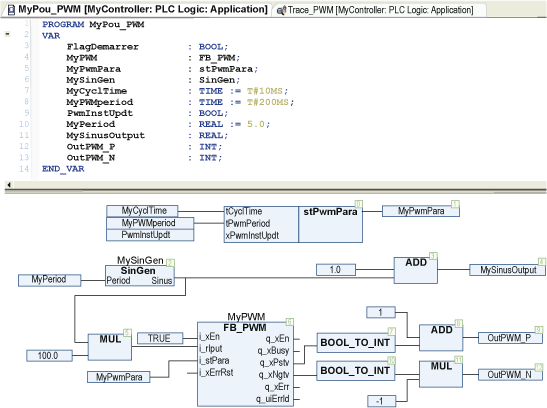
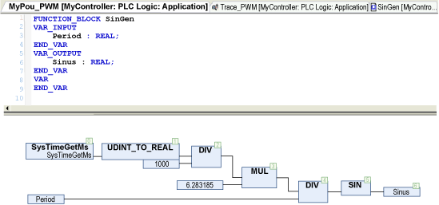
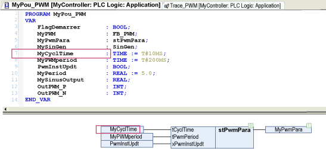
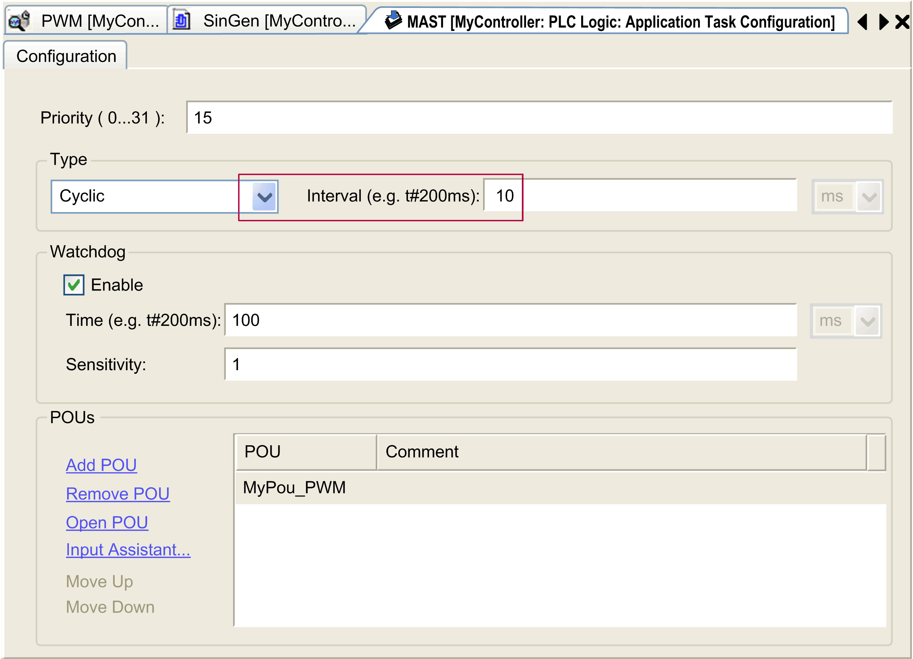
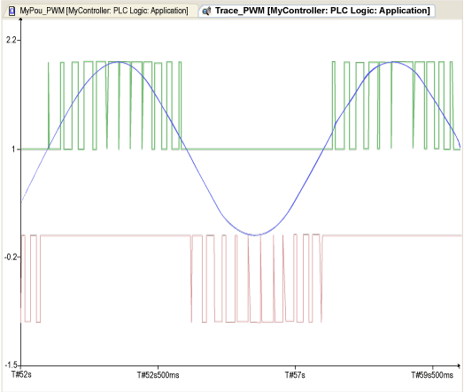

# `FB_PWM` Function Block

## Pin Diagram

This figure shows the pin diagram of the `FB_PWM` function block:

## Functional Description

The `FB_PWM` function block is developed to provide a PWM output based on the input parameter.

The PWM output is generated with defined ON time and OFF time as per the input shown in the first timing diagram below.

With reference to the second timing diagram:

* If `i_rIput` is a positive value, then the PWM output is available in the `q_xPstv`. The input `i_rIput` should be in a range of -100 to 100. The ON time of PWM is determined as given below: PWM ON time = (`i_rIput` x tPwmPeriod) / 100.
* If `i_rIput` is a negative value, then the PWM output is available in `q_xNgtv`.
* If `i_rIput` is greater than 100, then it is limited to 100 and if `i_rIput` is less than –100, then it is limited to –100.
* If `i_xPwmInstUpdt` is TRUE, the change in input parameter is updated in the current PWM cycle itself as shown in the timing diagram.
* If `i_xPwmInstUpdt` is FALSE, the change in input is updated only during a start of a new PWM cycle.

The `q_xEn` is TRUE as long as the input `i_xEn` is TRUE, regardless of detected error.

This figure shows the timing diagram for `FB_PWM` calculation:

## Timing Diagram

This figure shows the timing diagram for `FB_PWM` function block:

## Example with a Frequency Signal

The program creates a Sinus signal at a certain period (5 seconds/0.2 Hz). This Sinus signal is the input of the `FB_PWM`.

Definition of the `SinGen` function block:

The input `stPwmPara.tCycTime` of the `FB_PWM` function block must have exactly the same value as the period of the POU in the MAST, here 10 milliseconds (see the red bordered area).

The result of the previous POU:

**Blue** `i_rIput` sinus signal at 0.2 Hz (function block `My_Filter_PT1_1`).

**Green** `q_xPstv` (an offset is added for the trace).

**Red** `q_xNgtv` (the signal is inversed for the trace).

## Detected Error State

An invalid parameter at the function block inputs results in detected error and corresponding detected error ID is generated.

During detected error state, the output is set to zero.

The detected error can be reset only through rising edge of `i_xErrRst` input. The output `q_xBusy` is TRUE whenever the function block is enabled and there is no detected error.

EIO0000000096.09