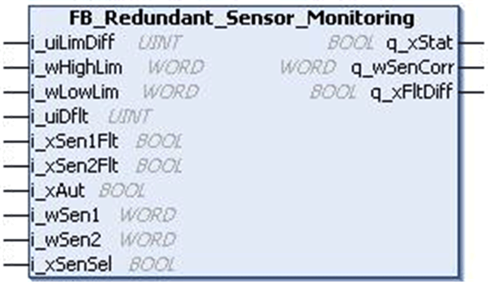
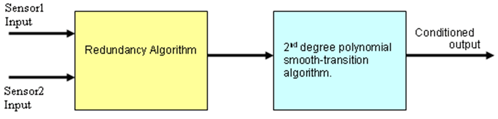

# `FB_Redundant_Sensor_Monitoring` Function Block

## Pin Diagram

This figure shows the pin diagram of the `FB_Redundant_Sensor_Monitoring` function block:

## Functional Description

The `FB_Redundant_Sensor_Monitoring` function block monitors signals coming in from two redundant analog signal sources or field sensors which have the same range and characteristics.

The function block does the following functions:

* Manipulates the output as per sensor(s) readings (average value).
* Monitors if the 2 sensor readings are within the specified difference limit, otherwise takes corrective action.
* Performs predefined action in case of any inoperable sensor is reported.
* Automatic selection of healthy sensor for output in case of other inoperable sensor.
* Provision to select any sensor manually.
* A second-degree polynomial based 'smooth-transition algorithm' eliminates any sudden step variation in the output of the block.
* The output for a detected difference between the two sensors is set to TRUE when the difference between the two sensor values is not within the limits. The difference between sensor input values is reset immediately after the difference between the sensor inputs are within the limits.

This figure shows the block diagram of the `FB_Redundant_Sensor_Monitoring` function block:

This table contains the second degree polynomial smooth-transition algorithm conditions:

| Example | Condition | FB Output |
| --- | --- | --- |
| 1 | Absolute difference between calculated output and previous FB output is greater than or equal to 15, calculated output is greater than previous FB output. | Previous FB output - ((0.07 \* (Calculated output - Previous FB output)) - 23) |
| 2 | Absolute difference between calculated output and previous FB output is greater than or equal to 15, calculated output is less than or equal to previous FB output. | Previous FB output - ((0.07 \* (Calculated output - Previous FB output)) + 23) |
| 3 | Absolute difference between calculated output and previous FB output is less than 15. | Calculated output |

EIO0000000096.09