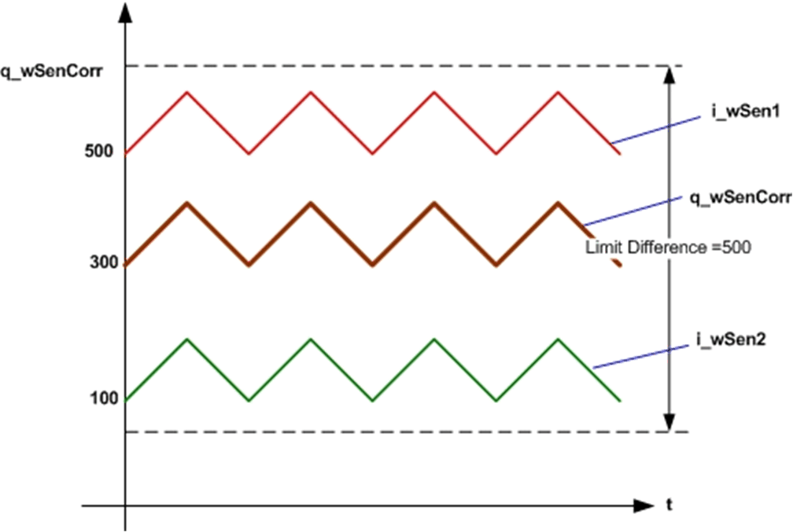
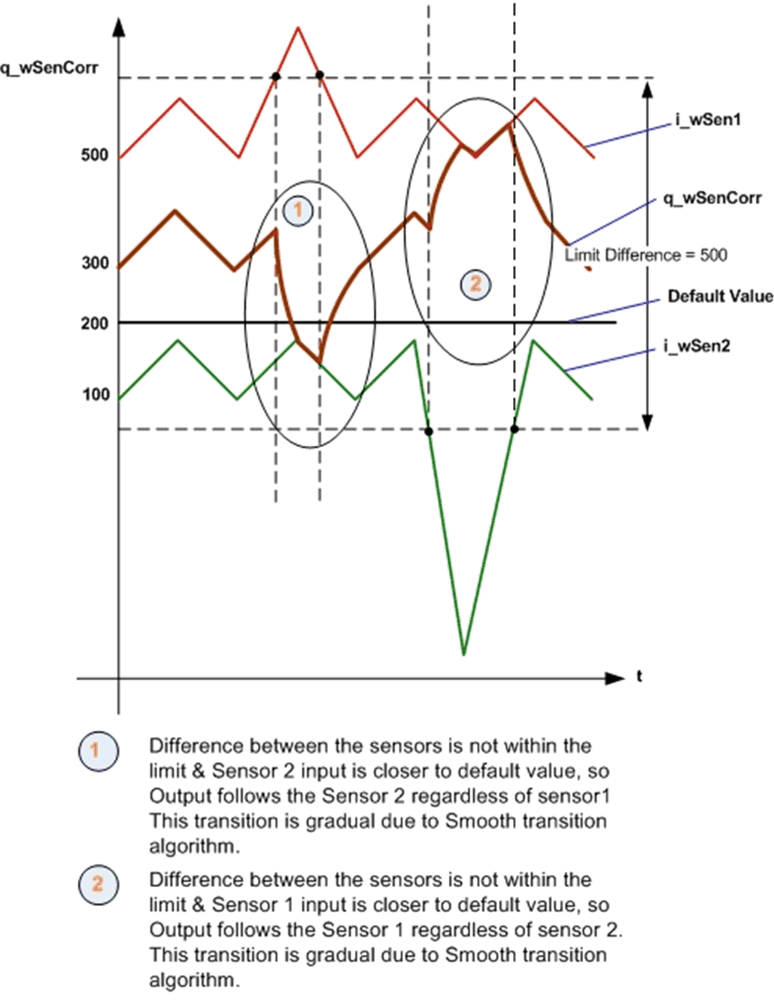

# Input Pin Description

## Input Pin Description

This table describes the input pins of the `FB_Redundant_Sensor_Monitoring` function block:

| Output | Data Type | Description |
| --- | --- | --- |
| `i_uiLimDiff` | `UINT` | The difference between sensor-1 and sensor-2 values in % of the sensor range within which the redundant sensors shall work.  Range: 0...100  Value exceeding 100% is limited to 100%.  0%: There should not be any difference between sensors.  100%: Accept any value that comes in or always average Sen1\_ip and Sen2\_ip. |
| `i_wHighLim` | `WORD` | High limit of sensor inputs  Range: 0...65535 |
| `i_wLowLim` | `WORD` | Low limit of sensor inputs  Range: 0...65535 |
| `i_uiDflt` | `UINT` | Default value in terms of % of the sensor input range  Range: 0...100 |
| `i_xSen1Flt` | `BOOL` | TRUE: Sensor is in detected error  FALSE: Sensor is healthy.  (Optional) |
| `i_xSen2Flt` | `BOOL` | TRUE: Sensor is in detected error.  FALSE: Sensor is healthy.  (Optional) |
| `i_xAut` | `BOOL` | TRUE: Auto mode  FALSE: Manual mode. |
| `i_wSen1` | `WORD` | Sensor-1 raw value  Range: 0...65535  (It is expected that sensor-1 and 2 shall be of same range and characteristics.) |
| `i_wSen2` | `WORD` | Sensor-2 raw value  Range: 0...65535  (It is expected that sensor-1 and 2 shall be of same range and characteristics.) |
| `i_xSenSel` | `BOOL` | TRUE: Sensor 2 selected  FALSE: Sensor 1 selected  Applicable only for manual mode. |

## `i_uiLimDiff`

This is Limit difference in terms of %. Averaged output (`q_wSenCorr`) is generated only if the difference between two sensor inputs is less than the Limit Difference.

* Limit difference is calculated based on the below equation

  Limit Difference = (`i_uiLimDiff` x (`i_wHighLim` - `i_wLowLim`))/100
* If the difference between Sensor 1 input and sensor 2 input is less than the Limit Difference, then output is average of two sensors as shown in the following figure.

This figure shows the averaging function in `FB_Redundant_Sensor_Monitoring` function block:

## `i_uiDflt`

This input is default value in terms of % which is used to generate most appropriate output the difference is not within the limit and both the sensors are healthy.

* Default value is calculated based on the below equation:

  Default value = (`i_uiDflt` x (`i_wHighLim` - `i_wLowLim`))/100
* If the difference between 2 sensor input is out of limit, the function block gives an output of anyone sensor which is closer to the default value as shown in the following figure.

This figure shows the default value function in `FB_Redundant_Sensor_Monitoring` function block:

## `i_xSen1Flt` and `i_xSen2Flt`

These inputs are used to detect whether the two sensors are healthy or not healthy.

* If both the sensors are not healthy, the output (`q_wSenCorr`) is set to zero.
* If sensor 1 is not healthy, then the output is set to sensor 2 input. Similarly if sensor 2 is not healthy, then the output is set to sensor 1 input.

## `i_xAut`

This input is used to select auto mode or manual mode.

* If this input is TRUE, the function block operates in auto mode. In auto mode, based on sensor inputs and difference between the inputs, function block generates an appropriate output.
* If this input is FALSE, the function block operates in manual mode. In manual mode, based `i_xSenSel` input the output is forced to either sensor 1 or sensor 2.
* If `i_xSenSel` is FALSE, sensor 1 input is selected. Similarly if `i_xSenSel` is TRUE, sensor 2 input is selected.

EIO0000000096.09