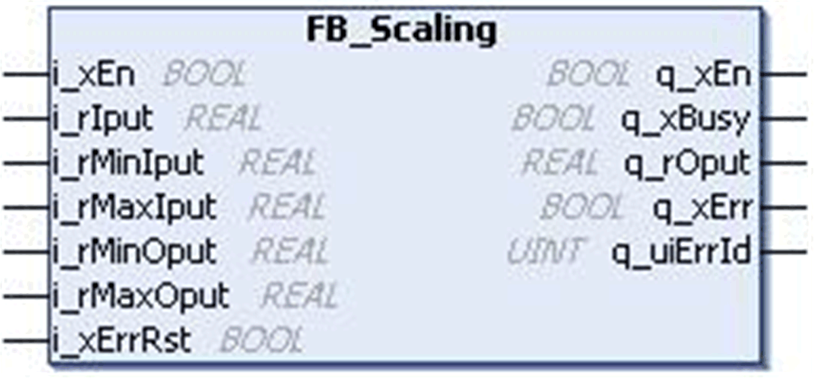
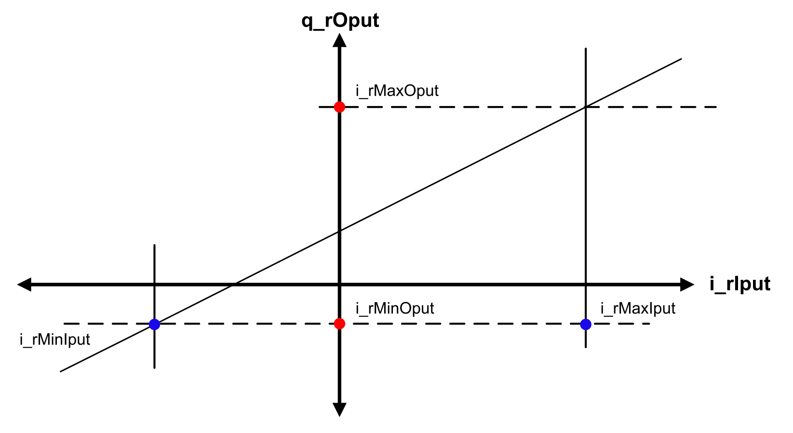
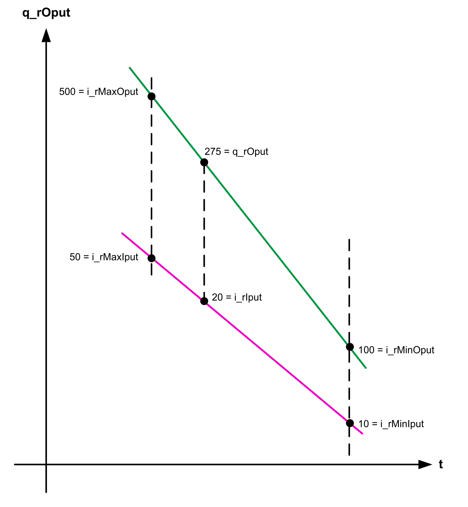

# FB\_Scaling Function Block

## Pin Diagram

This figure shows the pin diagram of the FB\_Scaling function block:

## Functional Description

The FB\_Scaling function block is developed to convert an input value to a specified output range linearly and an error is detected in case of an invalid parameter.

This function block scales an input signal to a linear output, relative to a defined maximum and minimum range. The minimum and maximum values used for scaling are not limiting the output value.

NOTE: For a limitation of the scaled value provided by the function block, use FB\_Limiter.

The input signal is scaled in a linear manner with reference to two value ranges as shown in the figure below:

The output changes dynamically based on the change in input:

* Slope = (i\_rMaxOput-i\_rMinOput) / (i\_rMaxIput - i\_rMinIput)
* Offset = i\_rOutMax - (Slope \* i\_rMaxIput)
* q\_rOput = (Slope \* i\_rIput) + Offset

The q\_xEn is TRUE as long as the input i\_xEn is TRUE, regardless of a detected error.

## Detected Error State

An invalid parameter at the function block inputs results in a detected error and a corresponding detected error ID is generated. The output is set to zero during a detected error. The detected error can be reset only through a rising edge of i\_xErrRst. The input q\_xBusy is TRUE whenever the function block is enabled and there is no detected error.

EIO0000000096.09