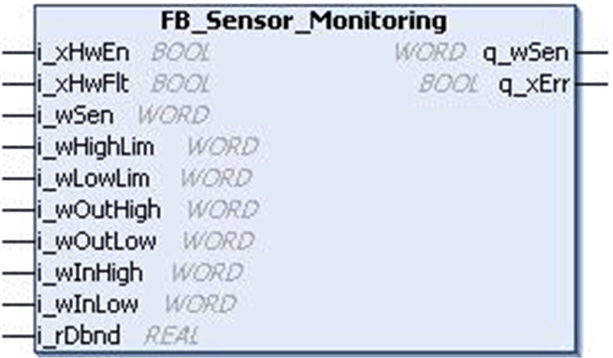
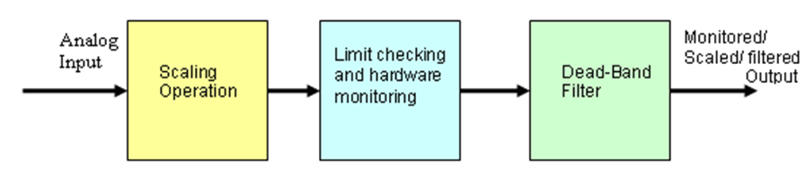

# `FB_Sensor_Monitoring` Function Block

## Pin Diagram

This figure shows the pin diagram of the `FB_Sensor_Monitoring` function block:

## Functional Description

The `FB_Sensor_Monitoring` function block monitors and/or scales and/or Deadband filters an input analog signal.

This function block performs the following operations on an analog input signal:

* Monitor if the sensor reading is within the operator specified range, otherwise an error output is detected if not within the range.
* Monitor I/O hardware and generate an alarm if an error is detected.
* Provision to enable/disable the I/O hardware monitoring feature in the block.
* Scale the input value to the desired output range.
* Pass the final output through a dead-band filter. Deadband suppresses the relative oscillation based on the previous input and present input, and then generates an output.

This figure shows the `FB_Sensor_Monitoring` block diagram:

EIO0000000096.09