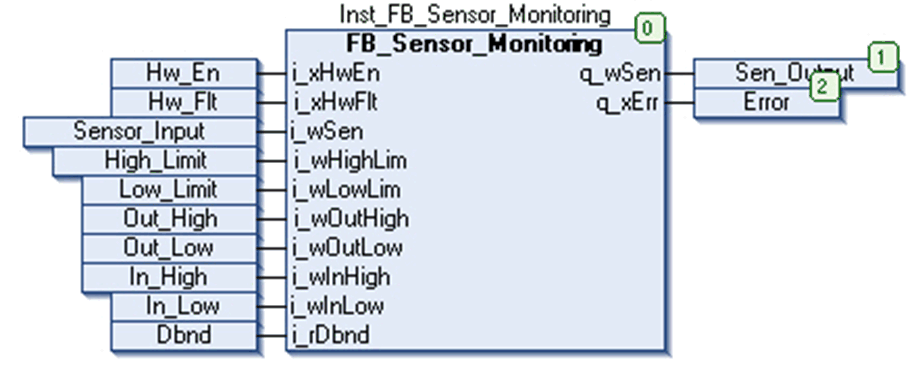

# Instantiation and Usage Example

## Instantiation and Usage Example

This figure shows an instance of the `FB_Sensor_Monitoring` function block pin diagram:

## Example

This example illustrates the functionality of different features in `FB_Sensor_Monitoring` function block:

| Example | Steps | Inputs | Outputs |
| --- | --- | --- | --- |
| 1 | Scaling:  Based on the scaling input parameters, sensor input `i_wSen` is scaled linearly and scaled output value is passed for limit checking. | `i_wSen` = 1000, `i_wOutHigh` = 2000, `i_wOutLow` = 100, `i_wInHigh` = 1000, `i_wInLow` = 10. | Internal calculated scaled output = 2000 |
| 2 | Limit checking:   * If calculated scaled output is greater than maximum limiting Input, `i_wHighLim` than output is limited to `i_wHighLim` * If calculated scaled output is less than minimum limiting input, `i_wLowLim` than output is limited to `i_wLowLim` * If calculated scaled output is within the limit, the calculated scaled output is processed further for deadband functions.   `q_xErr` will be TRUE if calculated scaled output is out of range for more than 3 consecutive controller scan cycles. | `i_wSen` = 1000, `i_wHighLim` = 20000, `i_wLowLim` = 4000, `i_wOutHigh` = 2000, `i_wOutLow` = 100, `i_wInHigh` = 1000, `i_wInLow` = 10, `i_rDbnd` = 10. | Internal output after limit check = 4000  `q_xErr` = FALSE/TRUE. |
| 3 | Hardware detected error monitoring: `q_xErr` output is TRUE and `q_wSen` holds its last value when hardware detected error monitoring is enabled and hardware (`i_xHwFlt`) detected error input is TRUE. | `i_xHwEn`=1, `i_xHwFlt`=1, `i_wSen`=1000, `i_wOutHigh`=2000, `i_wOutLow`=100, `i_wInHigh`=1000, `i_wInLow`=10, `i_rDbnd`=10. | `q_wSen` = 4000, `q_xErr` = TRUE. |
| 4 | Deadband filtering:   * If difference between calculated scaled output and previous FB output is less or equal to calculated deadband difference value (That is [(`i_rDbnd`/100) x (`i_wHighLim`-`i_wLowLim`)]), final FB output is equal to previous FB output. * If difference between calculated scaled output and previous FB output is greater than calculated deadband difference value (That is [(`i_rDbnd`/100) x (`i_wHighLim`-`i_wLowLim`)]), final FB output is equal to calculated scaled output.   `q_xErr` status output can be equal to 0 or 1 depending on limit checking and hardware detected error monitoring functionality explained above.  Note: `i_rDbnd` = 0: No deadband filtering. `i_rDbnd` >= 100: Block all signals. | `i_wSen` = 1000, `i_wHighLim` = 20000, `i_wLowLim` = 4000, `i_wOutHigh` = 2000, `i_wOutLow` = 100, `i_wInHigh` = 1000, `i_wInLow` = 10, `i_rDbnd` = 10. | `q_wSen` = 4000, `q_xErr` = False. |

EIO0000000096.09