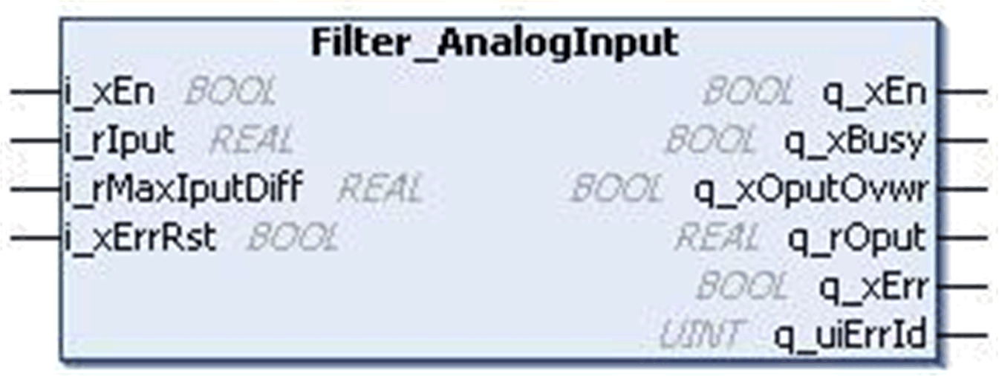
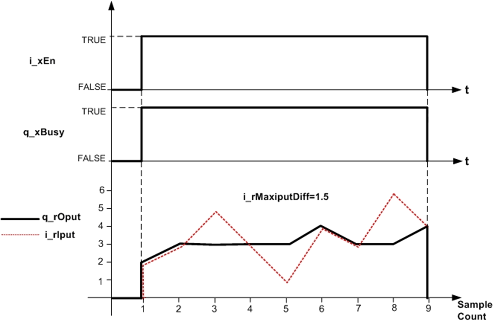

# `Filter_AnalogInput` Function Block

## Pin Diagram

This figure shows the pin diagram of the `Filter_AnalogInput` function block:

## Functional Description

The `Filter_AnalogInput` function block checks the plausibility on a measured analog input.

In normal state of operation, if the difference between the present and previous input value:

* is less than or equal to the specified value `i_rMaxIputDiff`, then the output follows the input value.
* is greater than the specified value `i_rMaxIputDiff`, then the output is overwritten by the previous output value for the maximum of three controller scan cycles. Output overwritten status bit `q_xOputOvwr` is TRUE in this condition.
* exceeds the specified value `i_rMaxIputDiff` for more than three consecutive controller scan cycles, the output again follows the input value.

NOTE: When the function block is enabled, during the first scan cycle the input is assigned to the output.

## Example

Maximum difference between present and previous inputs (`i_rMaxIputDiff`) = 1.5:

| Scan Cycle | Input Value (`i_rIput`) | Output Value (`q_rOput`) | Output Overwritten Bit (`q_xOputOvwr`) |
| --- | --- | --- | --- |
| First | 2.0 | 2.0 | FALSE |
| Second | 3.0 | 3.0 | FALSE |
| Third | 5.0 | 3.0 | TRUE |
| Fourth | 3.0 | 3.0 | TRUE |
| Fifth | 1.0 | 3.0 | TRUE |
| Sixth | 4.0 | 4.0 | FALSE |

This figure shows the normal behavior of the `Filter_AnalogInput` function block:

## Detected Error State

Invalid parameter such as `i_rMaxIputDiff` < 0 results in a detected error and corresponding detected error ID is generated. During the error detected state, the output is set to zero.

Detected error can be reset only through the rising edge of `i_xErrRst` input.

As shown in the behavior of output figure above, `q_xBusy` is TRUE whenever the function block is enabled and when there is no detected error.

EIO0000000096.09