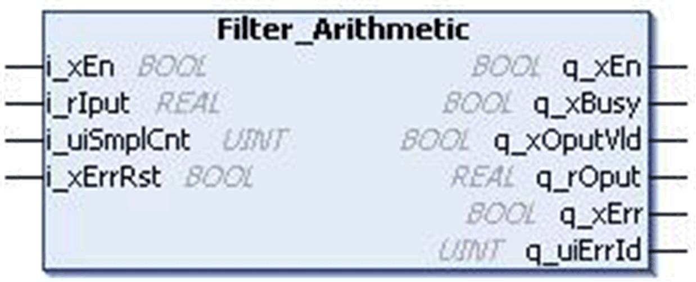
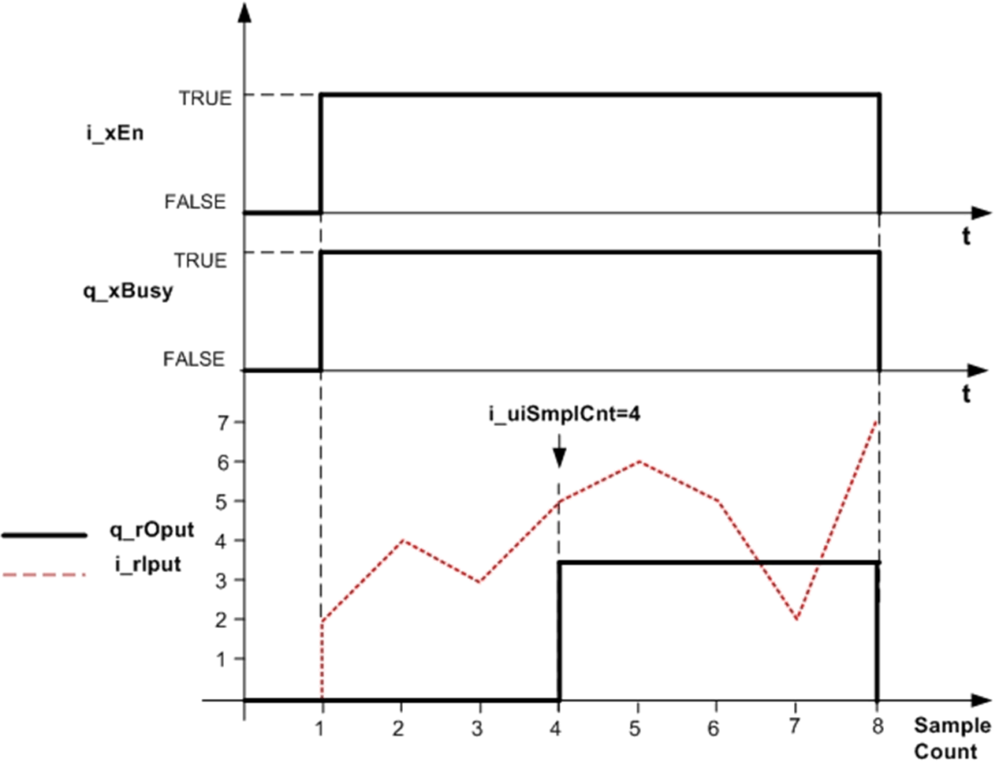
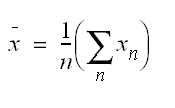
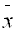

# `Filter_Arithmetic` Function Block

## Pin Diagram

This figure shows the pin diagram of the `Filter_Arithmetic` function block:

## Functional Description

The `Filter_Arithmetic` function block calculates the arithmetic average value for the user defined number of input samples.

Once the function block is enabled, the output calculation begins.

When the number of samples recorded is equal to the specified value `i_uiSmplCnt`, the function block gives an averaged output and the output valid bit `q_xOputVld` becomes TRUE.

The function block output holds this value until the function block is disabled or is in the detected error state.

## Example

Number of samples to average (`i_uiSmplCnt`) = 4:

| Scan Cycle | Input Value (`i_rIput`) | Output Value (`q_rOput`) | Output Valid Bit (`q_xOputVld`) |
| --- | --- | --- | --- |
| First | 2.0 | 0 | FALSE |
| Second | 4.0 | 0 | FALSE |
| Third | 3.0 | 0 | FALSE |
| Fourth | 5.0 | 3.5 | TRUE |
| Fifth | 6.0 | 3.5 | TRUE |
| Sixth | 5.0 | 3.5 | TRUE |

This figure shows normal output behavior:

## Mathematical Background

This equation shows the generalized arithmetic mean value:

Where:

n = Number of samples entered by user for mean value calculation,

Xn = Input samples,

 = Calculated output.

## Detected Error State

Invalid parameter such as `i_uiSmplCnt` = 0 results in a detected error and corresponding detected error ID is generated. During the detected error state, the output is set to zero.

Detected error can be reset only through the rising edge of `i_xErrRst` input.

As shown in output behavior figure above, `q_xBusy` is TRUE whenever the function block is enabled and when there is no detected error.

EIO0000000096.09