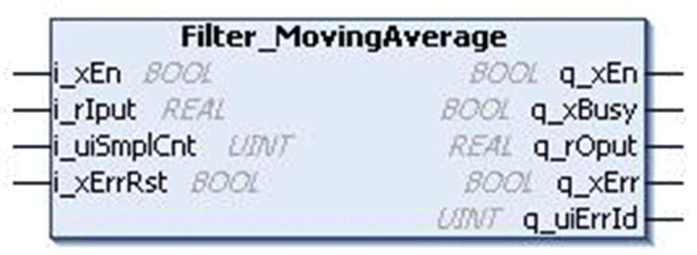
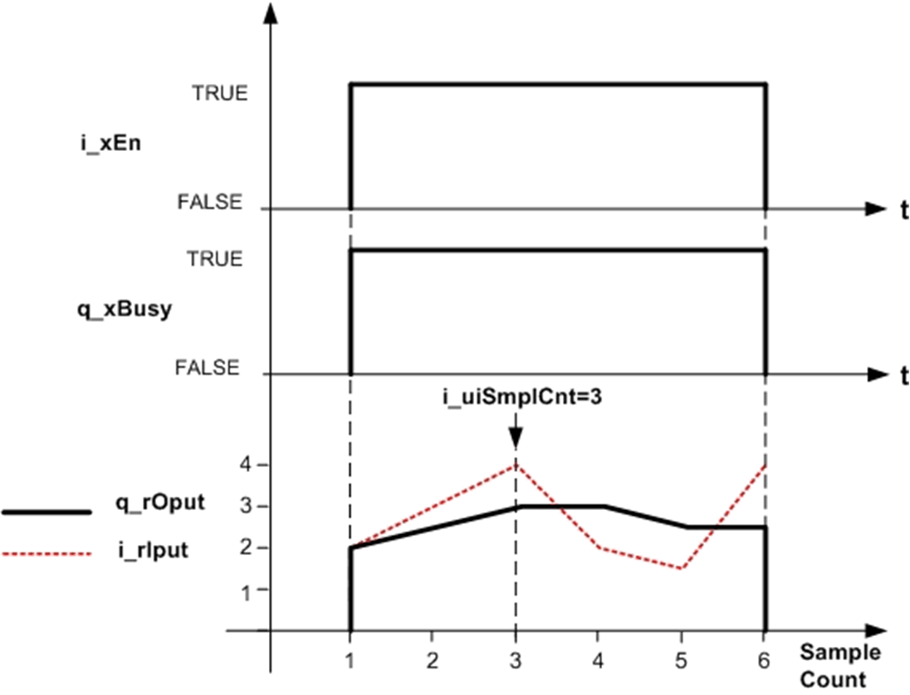
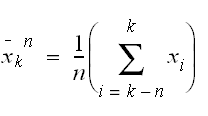
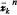

# `Filter_MovingAverage` Function Block

## Pin Diagram

This figure shows the pin diagram of the `Filter_MovingAverage` function block:

## Functional Description

The `Filter_MovingAverage` function block calculates the moving average value for the user-defined number of input samples.

When the number of recorded samples are:

* Less than the specified value `i_uiSmplCnt`, the function block calculates the average value with the available number of inputs and gives the corresponding output.
* Equal to or greater than the specified value `i_uiSmplCnt`, the function block calculates the average value with `i_uiSmplCnt` number of inputs and gives the corresponding output. It operates like the moving average filter.
* For `i_uiSmplCnt` = 0, the input value is assigned to output.

## Example

Number of Samples to average (`i_uiSmplCnt`) = 3:

| Scan Cycle | Input Value (`i_rIput`) | Output Value (`q_rOput`) |
| --- | --- | --- |
| 1 | 2.0 | 2.0 |
| 2 | 3.0 | 2.5 |
| 3 | 4.0 | 3.0 |
| 4 | 2.0 | 3.0 |
| 5 | 1.5 | 2.5 |
| 6 | 4.0 | 2.5 |

This figure shows normal behavior:

## Mathematical Background

This equation shows the generalized equation for the `Filter_MovingAverage` function:

n = Number of samples,

xi = Input samples,

k = GPL.Gc\_uiMaxAvgeSmpl, internal constant,

 = Calculated output.

## Note

In the event of a decrease in the number of sample counts (`i_uiSmplCnt`), the output (`q_rOput`) in the consequent scans is calculated by decreasing the number of samples by one in every consecutive scan.

## Detected Error State

Invalid parameter such as `i_uiSmplCnt` > GPL.Gc\_uiMaxAvgeSmpl results in detected error and corresponding detected error ID is generated.

During the detected error state, the output is set to zero.

Detected error can be reset only through the rising edge of `i_xErrRst` input.

As shown in behavior of output figure above, `q_xBusy` is TRUE whenever the function block is enabled and when there is no detected error.

EIO0000000096.09