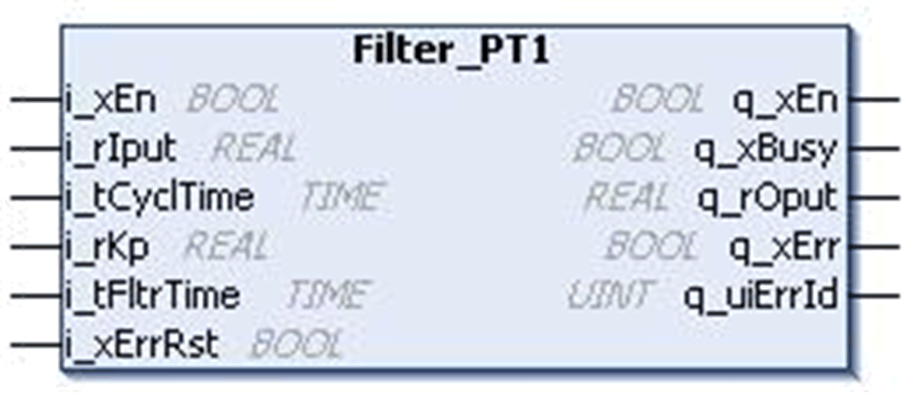
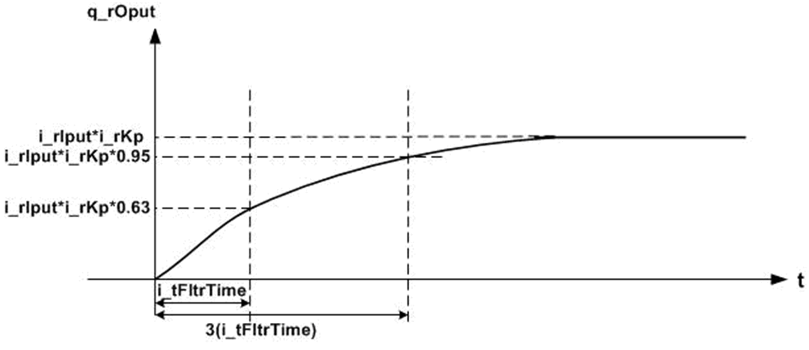
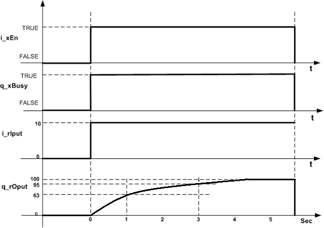
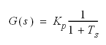

# `Filter_PT1` Function Block

## Pin Diagram

This figure shows the pin diagram of the `Filter_PT1` function block:

## Functional Description

The `Filter_PT1` function block provides a PT1 transfer function. The output value increases to 63% of input value within the time period equal to filter time constant. The output value reaches to 95% of input value after the time period equal to 3 \* Filter time constant and then reaches gradually to 100% of the input value.

This figure shows the output profile functionality of the `Filter_PT1` function block:

When the period is equal to:

* The filter time constant, the output value increases to 63% of the input value,
* Three times the filter time constant, the output value increases to 95% of the input value and then gradually reaches to 100% of the input.

## Example

If the input value (`i_rIput`) equals 10 and the filtering time constant (`i_tFltrTime`) is one second for a filtering gain of 10, then the output value (`q_rOput`) will be equal to 63 after a time period of one second.

The output value will be equal to 95 after a time period of three seconds (three times the filter time constant), and then the output will gradually reach to 100.

This figure shows normal behavior:

## Mathematical Background

This equation shows the transfer function:

Where:

| Kp | = Function PT1 gain or amplification |
| Ts | = Function PT1 filter time constant |
| G(s) | = transfer function |

The equation shown above is a Laplace notation for the first-order low pass filter.

In digital-time systems, this function is often referred to as the pulse-transfer function (PT1 function).

## Detected Error State

Invalid parameter such as `i_tCyclTime` = 0 or `i_tFltrTime` < `i_tCyclTime` results in a detected error and corresponding detected error ID is generated. During the detected error state, the output is set to zero.

Detected error can be reset only through the rising edge of `i_xErrRst` input.

As shown in function block the output figure, `q_xBusy` is TRUE whenever the function block is enabled and when there is no detected error.

EIO0000000096.09