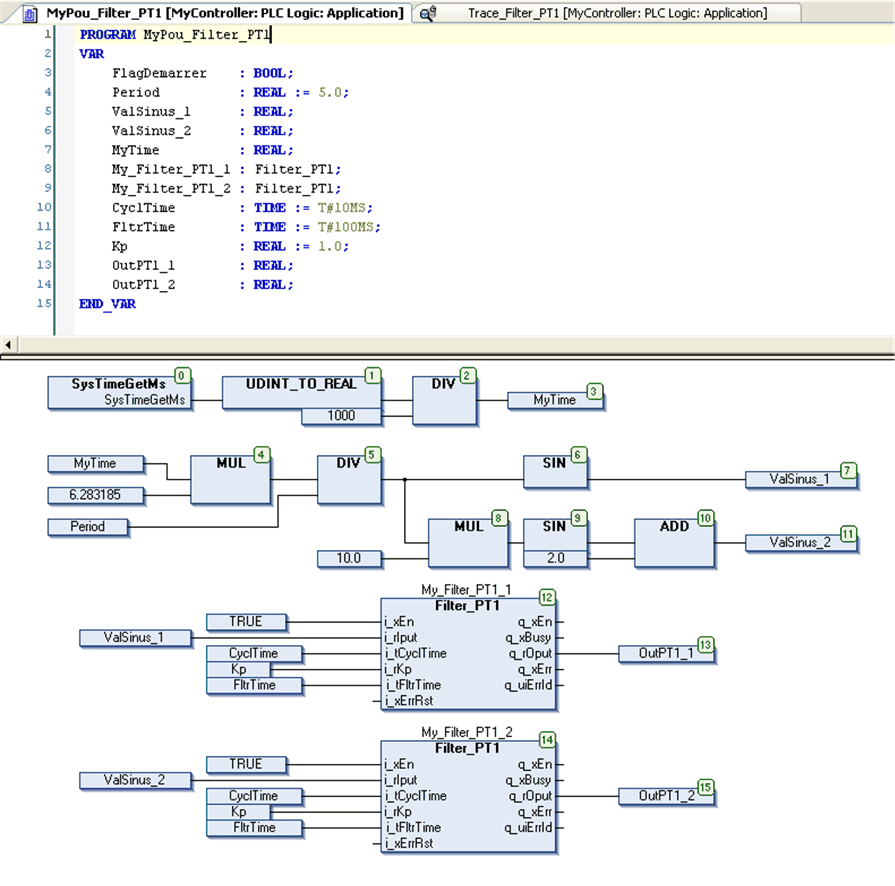
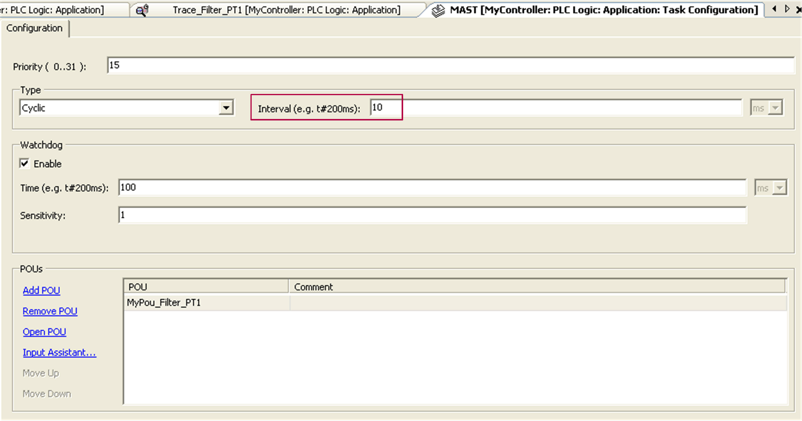
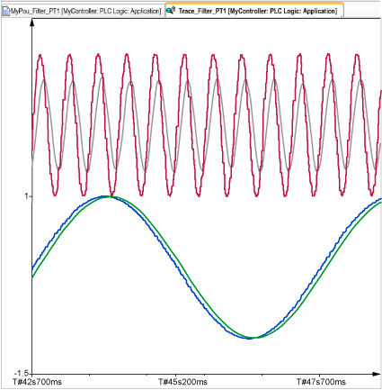
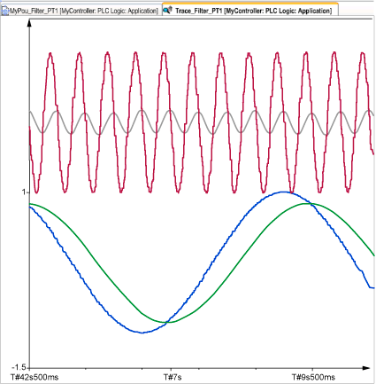

# Instantiation and Usage Example

## Example with a Frequency Signal

The program creates a Sinusoidal signal at a certain period (5 seconds/0.2 Hz) and a Sinusoidal signal one decade high (0.5 seconds/2 Hz).

The input `i_tCyclTime` of the `Filter_PT1` function block must have exactly the same value as the period of the POU in the MAST, here 10 milliseconds (See the red bordered area).

The result of the previous POU when the input `i_tFltrTime` equals 100 ms:

**Blue** `i_rIput` sinusoidal signal at 0.5 Hz (function block `My_Filter_PT1_1`)

**Green** `q_rOput` filtered signal (function block `My_Filter_PT1_1`)

**Red** `i_rIput` sinusoidal signal at 5 Hz (function block `My_Filter_PT1_2`)

**Gray** `q_rOput` filtered signal (function block `My_Filter_PT1_2`)

The result of the previous POU when the input `i_tFltrTime` equals 500 ms:

**Blue** `i_rIput` sinusoidal signal at 0.5 Hz (function block `My_Filter_PT1_1`)

**Green** `q_rOput` filtered signal (function block `My_Filter_PT1_1`)

**Red** `i_rIput` sinusoidal signal at 5 Hz (function block `My_Filter_PT1_2`)

**Gray** `q_rOput` filtered signal (function block `My_Filter_PT1_2`)

EIO0000000096.09