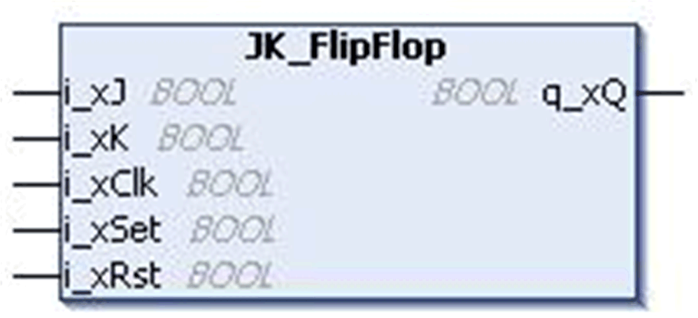
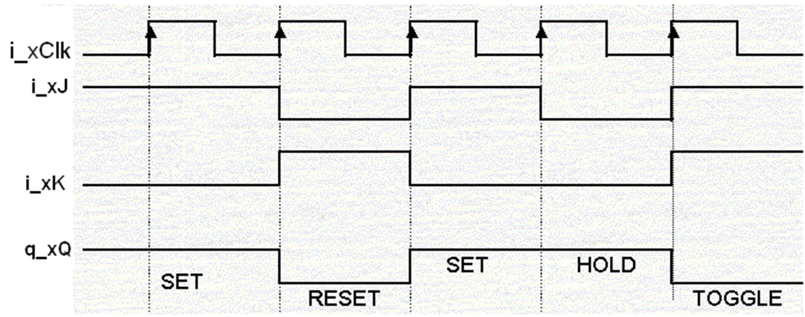

# `JK_FlipFlop` Function Block

## Pin Diagram

This figure shows the pin diagram of the `JK_FlipFlop` function block:

## Functional Description

The `JK_FlipFlop` function block implements the truth table for JK flip-flop.

This function block refers to a flip-flop that obeys this truth table:

| `i_xClk` | `i_xJ` | `i_xK` | `q_xQ(n)` | `q_xQ(n+1)` | Operation |
| --- | --- | --- | --- | --- | --- |
| 0 | X | X | X | Q(n) | Hold |
| RE | 0 | 0 | 0 | 0 | Hold |
| RE | 0 | 0 | 1 | 1 | Hold |
| RE | 0 | 1 | 0 | 0 | Reset |
| RE | 0 | 1 | 1 | 0 | Reset |
| RE | 1 | 0 | 0 | 1 | Set |
| RE | 1 | 0 | 1 | 1 | Set |
| RE | 1 | 1 | 0 | 1 | Toggle |
| RE | 1 | 1 | 1 | 0 | Toggle |
| **n** ‘n’ is the present state and (n+1) is the next state.  **RE** Rising Edge | | | | | |

The Reset input (`i_xRst`) resets the flip flop output `q_xQ`, whereas Set input (`i_xSet`) sets the flip flop output `q_xQ`.

Truth table represented as a time diagram:

## Input Pin Description

This table describes the input pins of the `JK_FlipFlop` function block:

| Input | Data Type | Description |
| --- | --- | --- |
| `i_xJ` | `BOOL` | TRUE: `i_xJ` input active.  FALSE: Disabled (factory setting) |
| `i_xK` | `BOOL` | TRUE: `i_xK` input active.  FALSE: Disabled (factory setting) |
| `i_xClk` | `BOOL` | TRUE: Clock signal active.  FALSE: Disabled (factory setting) |
| `i_xSet` | `BOOL` | TRUE: Sets the flip-flop output.  FALSE: Disabled (factory setting) |
| `i_xRst` | `BOOL` | TRUE: Resets the flip-flop output.  FALSE: Disabled (factory setting) |

## Output Pin Description

This table describes the output pins of the `JK_FlipFlop` function block:

| Output | Data Type | Description |
| --- | --- | --- |
| `q_xQ` | `BOOL` | Flip-flop output |

## Limitations

In JK flip-flop the inputs `i_xSet` and `i_xRst` have higher priority than `i_xJ` and `i_xK` inputs. When both the inputs `i_xSet` and `i_xRst` are either FALSE /TRUE then the output of the FB `q_xQ`, depends upon the inputs `i_xJ` and `i_xK` and `i_xClk`.

EIO0000000096.09