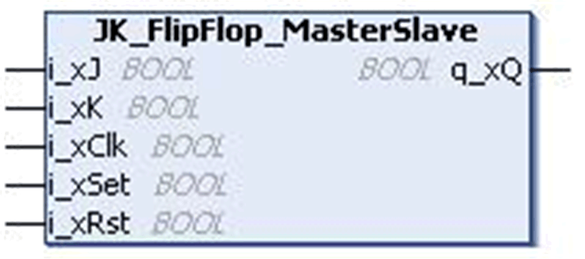
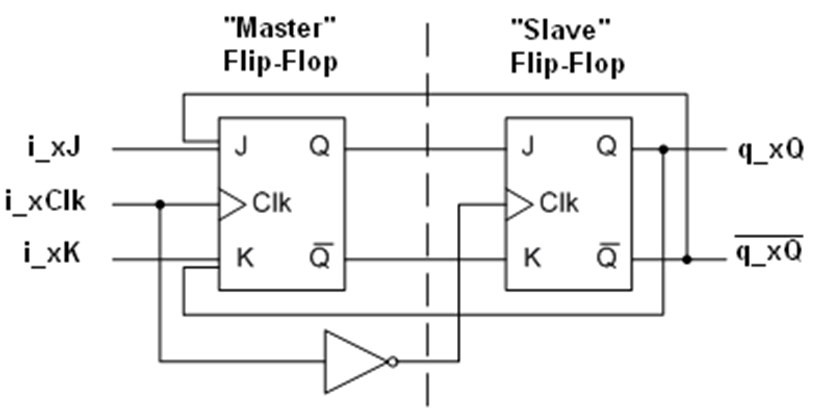
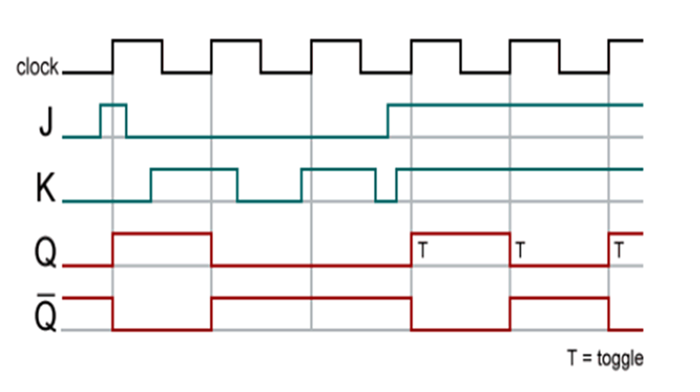

# `JK_FlipFlop_MasterSlave` Function Block

## Pin Diagram

This figure shows the pin diagram of the `JK_FlipFlop_MasterSlave` function block:

## Functional Description

The `JK_FlipFlop_MasterSlave` function block implements the truth table for master slave JK flip-flop. The master ouput is captured at rising edge of clock signal and output of slave is updated at falling edge of clock signal.

This diagram represents the internal construction of the `JK_FlipFlop_MasterSlave` function block.

NOTE: The complementary output \`q_xQ` is not an output of the FB.

The `JK_FlipFlop_MasterSlave` refers to a flip-flop that obeys this truth table:

| Set | Reset | CLK | J | K | Q |
| --- | --- | --- | --- | --- | --- |
| 1 | 0 | X | X | X | 1 |
| 0 | 1 | X | X | X | 0 |
| 1 | 1 | X | X | X | 1\* |
| 0 | 0 | ↑ | 0 | 0 | Unv. |
| 0 | 0 | ↑ | 1 | 0 | 1 |
| 0 | 0 | ↑ | 0 | 1 | 0 |
| 0 | 0 | ↑ | 1 | 1 | Toggle |
| 0 | 0 | 0 | X | X | Unv. |

The Reset input (`i_xRst`) resets the flip flop output `q_xQ`, whereas Set input (`i_xSet`) sets the flip flop output `q_xQ`.

Truth table represented as a time diagram:

## Input Pin Description

This table describes the input pins of the `JK_FlipFlop_MasterSlave` function block:

| Input | Data Type | Description |
| --- | --- | --- |
| `i_xJ` | `BOOL` | TRUE: `i_xJ` input active.  FALSE: Disabled (factory setting) |
| `i_xK` | `BOOL` | TRUE: `i_xK` input active.  FALSE: Disabled (factory setting) |
| `i_xClk` | `BOOL` | TRUE: Clock signal active.  FALSE: Disabled (factory setting) |
| `i_xSet` | `BOOL` | TRUE: Sets the flip-flop output.  FALSE: Disabled (factory setting) |
| `i_xRst` | `BOOL` | TRUE: Resets the flip-flop output.  FALSE: Disabled (factory setting) |

## Output Pin Description

This table describes the output pins of the `JK_FlipFlop_MasterSlave` function block:

| Output | Data Type | Description |
| --- | --- | --- |
| `q_xQ` | `BOOL` | Flip-flop output (True / False) |

## Limitations

In JK Master Slave flip-flop the inputs `i_xSet` and `i_xRst` have higher priority than `i_xJ` and `i_xK` inputs. When both the inputs `i_xSet` and `i_xRst` are either FALSE /TRUE then the output of the FB `q_xQ` depends upon the inputs `i_xJ` and `i_xK` and `i_xClk`.

EIO0000000096.09