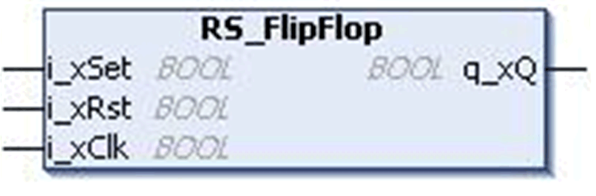
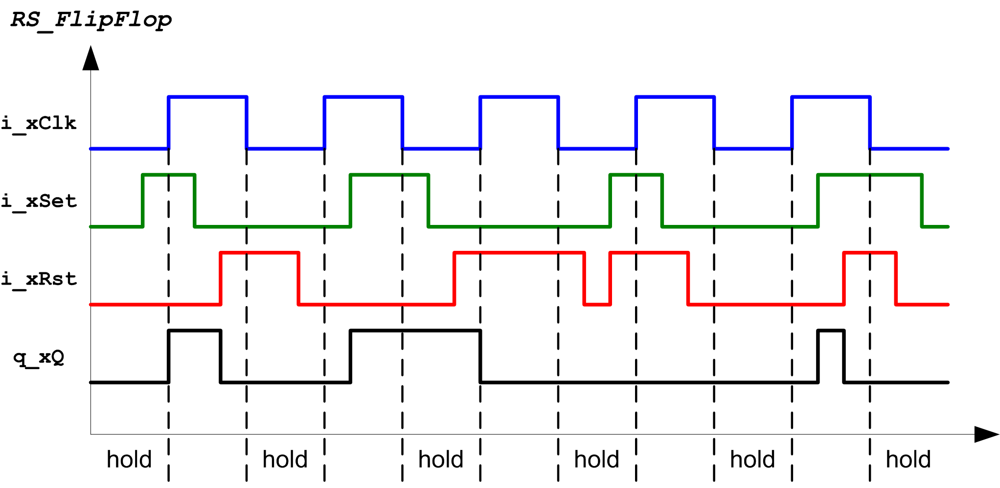

# `RS_FlipFlop` Function Block

## Pin Diagram

This figure shows the pin diagram of the `RS_FlipFlop` function block:

## Functional Description

The `RS_FlipFlop` function block implements the truth table for RS flip-flop with reset priority.

The `RS_FlipFlop` refers to a flip-flop that obeys this truth table:

| `i_xClk` | `i_xSet` | `i_xRst` | `q_xQ(n+1)` |
| --- | --- | --- | --- |
| 0 | X | X | Q(n) |
| 1 | 0 | 0 | Q(n) |
| 1 | 0 | 1 | 0 |
| 1 | 1 | 0 | 1 |
| 1 | 1 | 1 | 0 |
| **n** ‘n’ is the present state and (n+1) is the next state. | | | |

It has two inputs namely, a Set input or `i_xSet`, and a Reset input or `i_xRst`. It also has one output `q_xQ`. When both set and reset inputs are high, priority is given to Reset input (`i_xSet`=1 and `i_xRst`=1).

Truth table represented as a time diagram:

## Input Pin Description

This table describes the input pins of the `RS_FlipFlop` function block:

| Input | Data Type | Description |
| --- | --- | --- |
| `i_xClk` | `BOOL` | TRUE: Clock signal active.  FALSE: Disabled (factory setting) |
| `i_xSet` | `BOOL` | TRUE: Sets the flip-flop output.  FALSE: Disabled (factory setting) |
| `i_xRst` | `BOOL` | TRUE: Resets the flip-flop output.  FALSE: Disabled (factory setting) |

## Output Pin Description

This table describes the output pins of the `RS_FlipFlop` function block:

| Output | Data Type | Description |
| --- | --- | --- |
| `q_xQ` | `BOOL` | Flip-flop output |

EIO0000000096.09