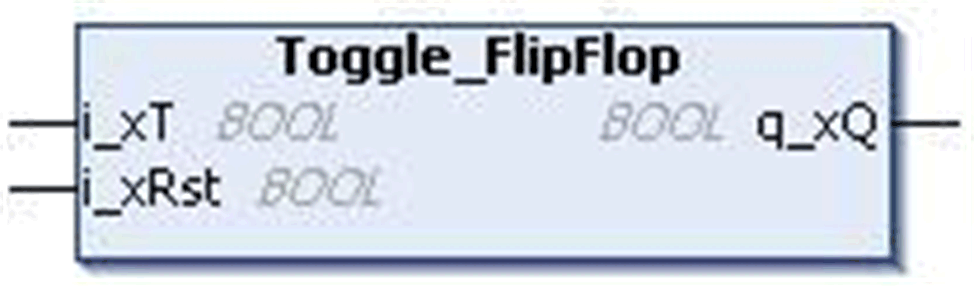

# `Toggle_FlipFlop` Function Block

## Pin Diagram

This figure shows the pin diagram of the `Toggle_FlipFlop` function block:

## Functional Description

The `Toggle_FlipFlop` function block implements the truth table for T(Toggle) flip-flop with set priority.

The `Toggle_FlipFlop` is a type of Flip-Flop which obeys this truth table:

| `i_xRst` | `i_xT`(n-1) | `i_xT`(n) | `q_xQ`(n) | `q_xQ`(n+1) |
| --- | --- | --- | --- | --- |
| 0 | 0 | 0 | X | Q(n) |
| 0 | 0 | 1 | 0 | 1 |
| 0 | 0 | 1 | 1 | 0 |
| 0 | 1 | x | x | Q(n) |
| 1 | x | x | x | 0 |
| **n** ‘n’ is the present state and (n+1) is the next state. | | | | |

It has two inputs, namely, `i_xT` input, and a Reset input, or `i_xRst`. It also has an output `q_xQ`.

## Input Pin Description

This table describes the input pins of the `Toggle_FlipFlop` function block:

| Input | Data Type | Description |
| --- | --- | --- |
| `i_xT` | `BOOL` | Rising edge 0...1 toggles the flip-flop.  Factory setting: FALSE |
| `i_xRst` | `BOOL` | TRUE: Resets the flip-flop output.  FALSE: Disabled (factory setting) |

## Output Pin Description

This table describes the output pins of the `Toggle_FlipFlop` function block:

| Output | Data Type | Description |
| --- | --- | --- |
| `q_xQ` | `BOOL` | Flip-flop output |

EIO0000000096.09