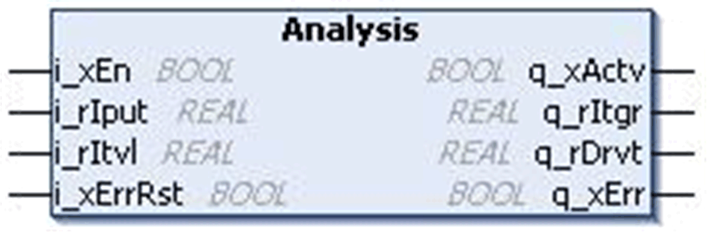

# `Analysis` Function Block

## Pin Diagram

This figure shows the pin diagram of the `Analysis` function block:

## Functional Description

The `Analysis` function block calculates the integral and derivative values of a series of input. The output starts with zero at the rising edge of `i_xEn`. The integral value increases in multiples of interval input.

In each scan both the integral output and the derivative output is updated based on the interval value.

An error is detected if the interval value is equal to/less than zero or if the input is out of range or if the integral or derivative outputs exceed 3.4e+38.

Integral = Integral + (Current Input + Previous Input) / 2 \* Interval.

Derivative = (Current Input - Previous Input)/ Interval.

## Example

Input = 10 (Previous input: 0), Interval = 10, then the outputs after the first cycle of execution are as below:

* Integral = 0 + (10+0) / 2 \* 10 = 50
* Derivative = (10-0)/ 10 = 1

## Input Pin Description

This table describes the input pins of the `Analysis` function block:

| Input | Data Type | Description |
| --- | --- | --- |
| `i_xEn` | `BOOL` | TRUE: FB enabled  FALSE: FB disabled |
| `i_rIput` | `REAL` | Input value  Range: 1.17e-38...3.4e38 |
| `i_rItvl` | `REAL` | Input value  Range: 1.17e-38...3.4e38 |
| `i_xErrRst` | `BOOL` | TRUE: Reset the detected error. (On rising edge)  (Optional) |

## Output Pin Description

This table describes the output pins:

| output | Data Type | Description |
| --- | --- | --- |
| `q_xActv` | `BOOL` | function block status output |
| `q_rItgr` | `REAL` | Integral value  Range: 1.17e-38...3.4e38 |
| `q_rDrvt` | `REAL` | Derivative value  Range: 1.17e-38...3.4e38 |
| `q_xErr` | `BOOL` | TRUE: `i_rItvl` input <= 0  or `i_rIput` < 1.17e-38  or `i_rIput` > 3.4e+38  or `q_rItgr` > 3.4e+38  or `q_rDrvt` > 3.4e+38  FALSE: No detected error |

EIO0000000096.09