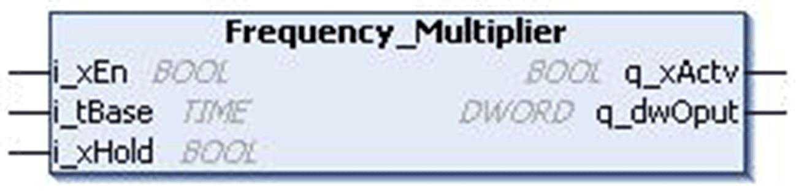

# `Frequency_Multiplier` Function Block

## Pin Diagram

This figure shows the pin diagram of the `Frequency_Multiplier` function block:

## Functional Description

The `Frequency_Multiplier` function block implements 32 blinkers represented by the bits of output.

On every rising edge of enable signal, the blinker output starts with zero. The lowest bit changes its state after a time base period. The second bit blinks with half the frequency of the initial one. The third bit blinks with half the frequency of the second one and so on, until enable signal is reset. If `i_xHold` input is set, then current state of blinkers is Hold. If blinkers of type `BOOL` are required the function block `DWORD_AS_BIT` (Util Library) can be used.

The output is reset on the rising edge of Enable input.

## Example

Frequencies (Enable = TRUE, Timebase = t#100ms, Hold = FALSE)

DWORD\_AS\_BIT (Input = Frequency ouput)

DWORD\_AS\_BIT.B00 is blinking with 100 ms

DWORD\_AS\_BIT.B01 is blinking with 200 ms

DWORD\_AS\_BIT.B02 is blinking with 400 ms

## Input Pin Description

This table describes the input pins of the `Frequency_Multiplier` function block:

| Input | Data Type | Description |
| --- | --- | --- |
| `i_xEn` | `BOOL` | TRUE: FB enabled  FALSE: Disabled |
| `i_tBase` | `TIME` | Time period  Range: 1...4294967295 ms (≥ cycle time of controller) |
| `i_xHold` | `BOOL` | TRUE: Active  FALSE: Disabled |

## Output Pin Description

This table describes the output pins of the `Frequency_Multiplier` function block:

| output | Data Type | Description |
| --- | --- | --- |
| `q_xActv` | `BOOL` | TRUE: FB enabled  FALSE: Disabled |
| `q_dwOput` | `DWORD` | Output status  Range: 0...4294967295 |

EIO0000000096.09