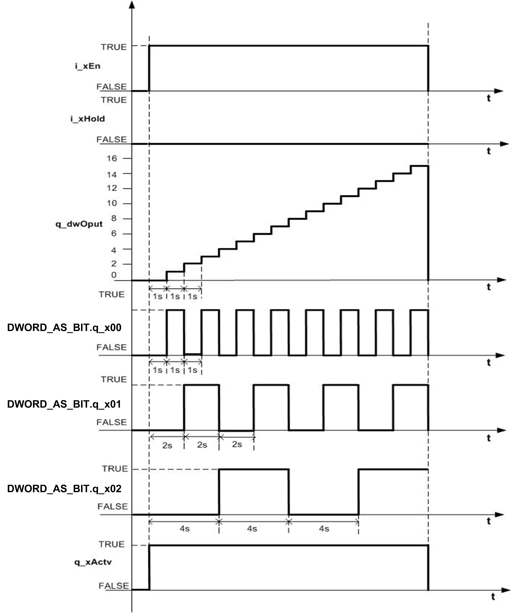

# Without Hold Condition Description

## Without Hold Condition

If input at pin `i_xEn` is high, `i_tBase` time is set to 1s and `i_xHold` input is FALSE, then `q_dwOput` is increased by one, after the completion of `i_tBase` time period.

`DWORD_AS_BIT` (Input: = `Frequency_Multiplier. q_dwOput`):

* `DWORD_AS_BIT.q_x00` is ON after 1 s of Enabling FB for Time base period
* `DWORD_AS_BIT.q_x01` is ON after 2 s of Enabling FB for 2 \* Time base period
* `DWORD_AS_BIT.q_x02` is ON after 4 s of Enabling FB for 4 \* Time base period

## Timing Diagram

This figure shows the timing diagram for the `Frequency_Multiplier` function block without hold input:

EIO0000000096.09