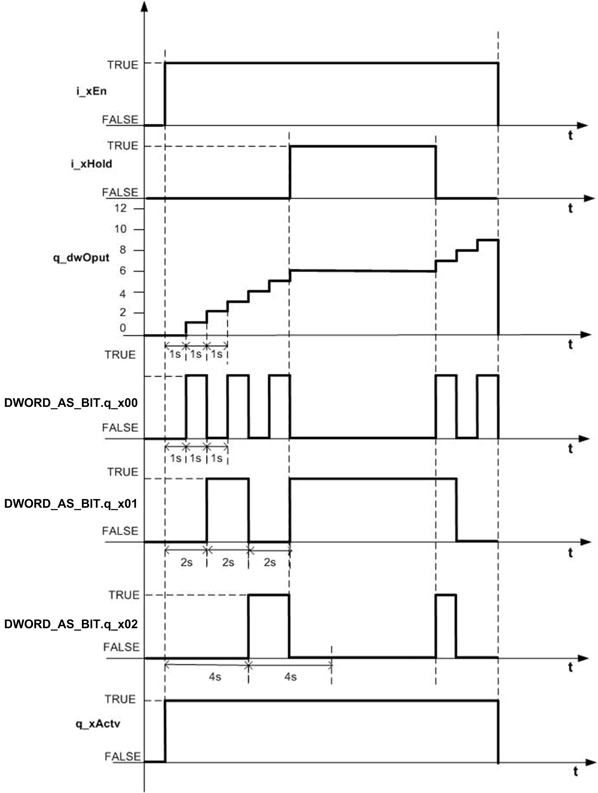

# Functionality With Condition Description

## Functionality Description

If input at pin `i_xEn` is high, `i_tBase` time is set to 1s and `i_xHold` input is TRUE, then `q_dwOput` HOLD the previous status of Blinkers. FB resumes with its normal operation again when `i_xHold` input goes to FALSE.

## Timing Diagram

This figure show the timing diagram for the `Frequency_Multiplier` function block with hold input:

EIO0000000096.09