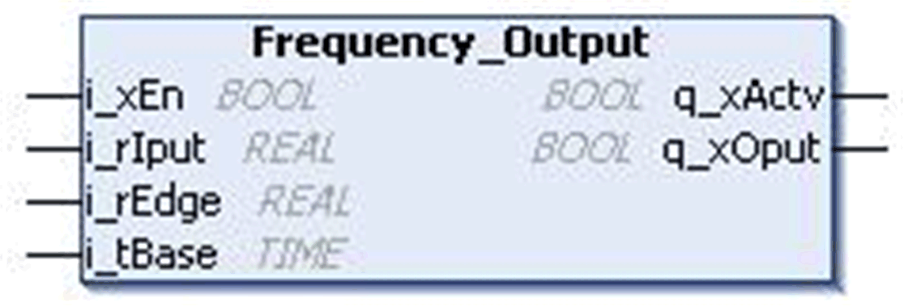
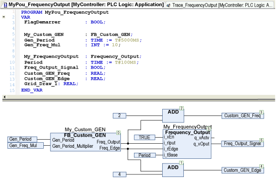
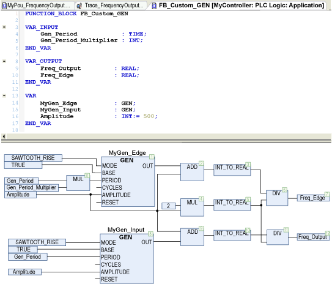
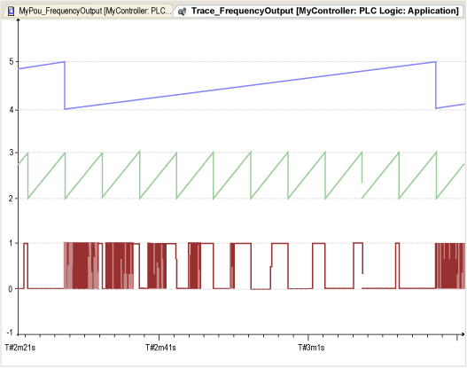
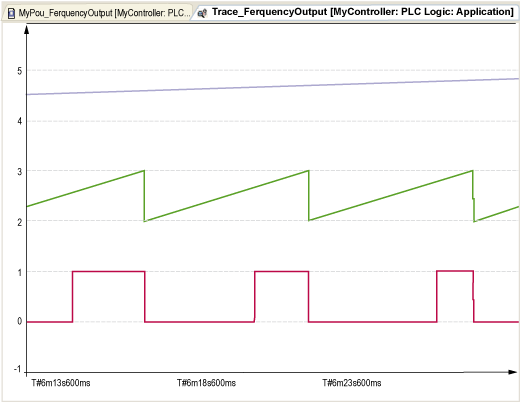
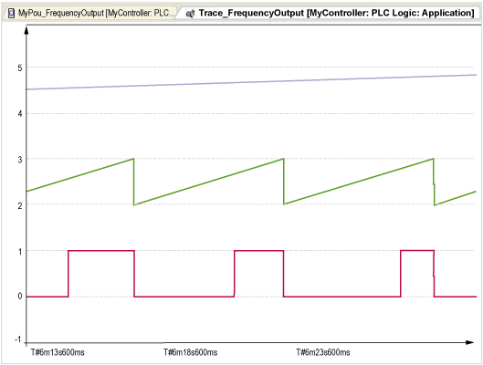
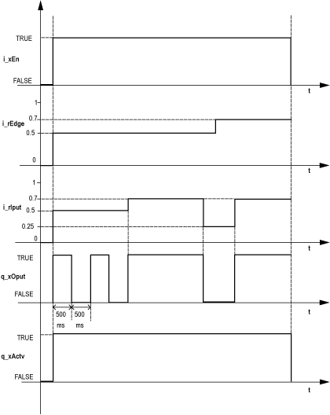

# `Frequency_Output` Function Block

## Pin Diagram

This figure shows the pin diagram of the `Frequency_Output` function block:

## Functional Description

The `Frequency_Output` function block implements frequencies.

A positive signal at `i_xEn` activates the block. The output signal starts with TRUE and holds this signal for a duration of (TimeBase \* `i_rIput`) and then it changes to FALSE for a duration of TimeBase \* (1-`i_rIput`).

If the input signal enters the edge range 0 to `i_rEdge`, the output signal no longer alternates and is continually FALSE. If it enters the range 1-`i_rEdge` to1 then the output signal is continuously TRUE.

If the signal at `i_xEn` is removed, the output signal remains at its current value until the function block is restarted through a positive signal at `i_xEn`.

## Input Pin Description

This table describes the input pins of the `Frequency_Output` function block:

| Input | Data Type | Description |
| --- | --- | --- |
| `i_xEn` | `BOOL` | TRUE: FB enabled  FALSE: Disabled |
| `i_rIput` | `REAL` | Input value  Range: 0.0...1.0 |
| `i_rEdge` | `REAL` | Input value  Range: 0.0...1.0 |
| `i_tBase` | `TIME` | Time period  Range: 0...4294967295 ms |

## Output Pin Description

This table describes the output pins of the `Frequency_Output` function block:

| output | Data Type | Description |
| --- | --- | --- |
| `q_xActv` | `BOOL` | function block active status |
| `q_xOput` | `BOOL` | Output value |

## Instantiation and Usage Example

The example use the following custom signal generators that creates 2 signals :

* A 5 seconds period signal that will be used as the input for the `Frequency_Output` function block.
* A 50 seconds period signal that will be used as the edge for the `Frequency_Output` function block.

This POU has a period of 10 ms in the MAST.

This figure shows the custom signal generator:

This example gives the following results:

**Blue** `i_rEdge` signal, period of 50 seconds.

**Green** `i_rIput` signal, period of 5 seconds.

**Red** `q_xOput`, output of the `Frequency_Output` function block.

This table shows the truth table:

| Edge level | Input level | Output |
| --- | --- | --- |
| `i_rEdge` < 0.5 | `i_rIput` < `i_rEdge` | FALSE |
| `i_rEdge` < `i_rIput` < (1-`i_rEdge`) | PWM; duty = `i_rIput` |
| (1 - `i_rEdge`) < `i_rIput` | TRUE |
| `i_rEdge` >= 0.5 | `i_rIput` < `i_rEdge` | FALSE |
| `i_rEdge` <= `i_rIput` | TRUE |

Example with `i_rEdge` < 0.5:

Example with `i_rEdge` >= 0.5:

Example: If the input at pin `i_xEn` is high, `i_rIput` input and initially `i_rEdge` input is set to 0.5 and `i_tBase` input is set to 1sec, then `q_xOput` is set for 500ms and reset for 500ms time period. After some time the input `i_rEdge` is changed to 0.7.

This figure shows the timing diagram of the above example:

EIO0000000096.09