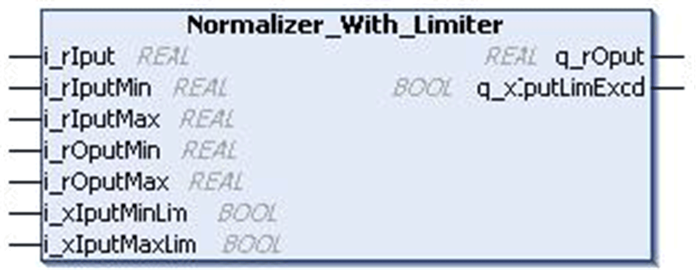
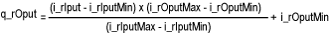
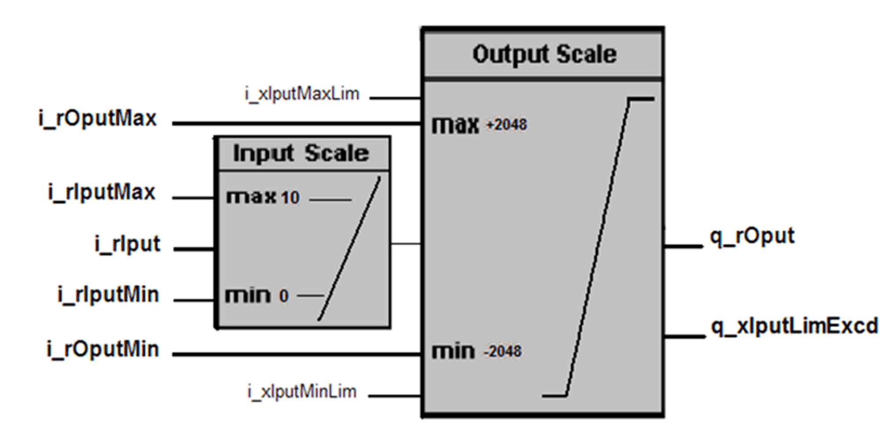

# `Normalizer_With_Limiter` Function Block

## Pin Diagram

This figure shows the pin diagram of the `Normalizer_With_Limiter` function block:

## Functional Description

The `Normalizer_With_Limiter` function block scales the minimum and maximum input value to the range of minimum and maximum output value. The input value can be limited to minimum and maximum output values.

The output value can be limited to minimum and maximum output values using `i_xIputMinLim` and `i_xIputMaxLim`.

When the input exceeds the maximum/minimum input limit value `q_xIputLimExcd` will be TRUE.

## Mathematical Backround

## Example

| `i_xIputMaxLim` | `i_xIputMinLim` | `i_rIput` | `q_rOput` | `q_xIputLimExcd` |
| --- | --- | --- | --- | --- |
| FALSE | FALSE | 12.5 | 3072 | TRUE |
| TRUE | FALSE | 12.5 | 2048 | TRUE |
| TRUE | FALSE | 10 | 2048 | FALSE |
| TRUE | FALSE | 7.5 | 1024 | FALSE |
| TRUE | TRUE | 5 | 0 | FALSE |
| FALSE | TRUE | 2.5 | -1024 | FALSE |
| FALSE | TRUE | 0 | -2048 | FALSE |
| FALSE | TRUE | -2.5 | -2048 | TRUE |
| FALSE | FALSE | -2.5 | -3072 | TRUE |

## Input Pin Description

This table describes the input pins of the `Normalizer_With_Limiter` function block:

| Input | Data Type | Description |
| --- | --- | --- |
| `i_rIput` | `REAL` | Input value  Range: ±3.4e+38 |
| `i_rIputMin` | `REAL` | Minimum input  Range: ±3.4e+38 |
| `i_rIputMax` | `REAL` | Maximum input value  Range: ±3.4e+38 |
| `i_rOputMin` | `REAL` | Minimum output value  Range: ±3.4e+38 |
| `i_rOputMax` | `REAL` | Maximum output value  Range: ±3.4e+38 |
| `i_xIputMinLim` | `BOOL` | TRUE: Limit enabled for minimum input value  FALSE:Limit disabled |
| `i_xIputMaxLim` | `BOOL` | TRUE: Limit enabled for maximum input value  FALSE:Limit disabled |

## Output Pin Description

This table describes the output pins of the `Normalizer_With_Limiter` function block:

| Output | Data Type | Description |
| --- | --- | --- |
| `q_rOput` | `REAL` | Scale output value  Range: ±3.4e+38 |
| `q_xIputLimExcd` | `BOOL` | Input value exceed limit value |

EIO0000000096.09