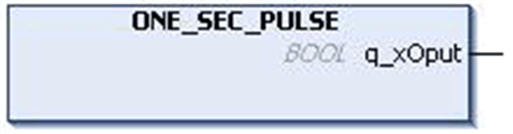
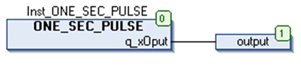

# `ONE_SEC_PULSE` Function Block

## Pin Diagram

This figure shows the pin diagram of the `ONE_SEC_PULSE` function block:

## Functional Description

The `ONE_SEC_PULSE` function block generates pulses of one second duration at the output `q_xOput`.

## Output Pin Description

This table describes the output pins of the `ONE_SEC_PULSE` function block:

| output | Data Type | Description |
| --- | --- | --- |
| `q_xOput` | `BOOL` | Output Pulse  Output state = TRUE during 1 cycle of task  Frequency = 1 Hz |

## Instantiation and Usage Example

The above figure shows an instance of `ONE_SEC_PULSE` function block:

EIO0000000096.09