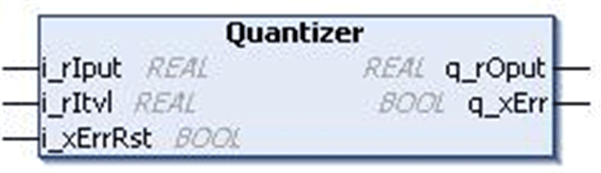
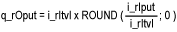

# `Quantizer` Function Block

## Pin Diagram

This figure shows the pin diagram of the `Quantizer` function block:

## Functional Description

The `Quantizer` function block discretes the input value (–32768 to 32767) for a given interval.

If the input is more than the input range then the detected error output is TRUE and the output displays a zero value.

## Mathematical Background

With Itvl = interval.

## Example

| Input | Interval | Output |
| --- | --- | --- |
| 32766.7 | 1 | 32767  Detected error = FALSE |
| 32768 | 15 | 0  Detected error = TRUE |
| -32768 | 20 | -32760  Detected error = FALSE |
| 36.89 | 15 | 30  Detected error = FALSE |
| -47.98 | -10 | -50  Detected error = FALSE |
| -42.14 | -10 | -40  Detected error = FALSE |
| 3456.78 | 80 | 3440  Detected error = FALSE |
| Between -4.99 to 4.99 | 10 | 0 |
| Between 5 to 14.99 | 10 | 10 |

## Input Pin Description

This table describes the input pins of the `Quantizer` function block:

| Input | Data Type | Description |
| --- | --- | --- |
| `i_rIput` | `REAL` | Input value  Range: -32768...32767 |
| `i_rItvl` | `REAL` | Quantization interval input value  Range: ±3.4e+38 |
| `i_xErrRst` | `BOOL` | Reset the detected error. (On rising edge)  (Optional) |

## Output Pin Description

This table describes the output pins of the `Quantizer` function block:

| output | Data Type | Description |
| --- | --- | --- |
| `q_rOput` | `REAL` | Output value  Range: -32768...32767 |
| `q_xErr` | `BOOL` | TRUE: Input limit exceed  FALSE: No detected error |

EIO0000000096.09