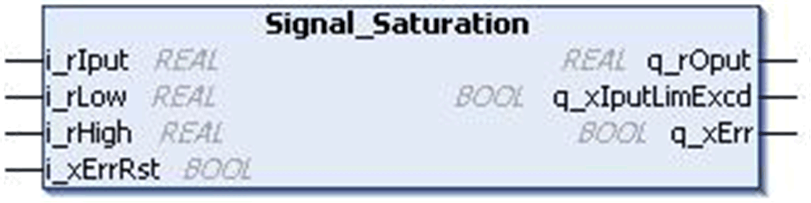
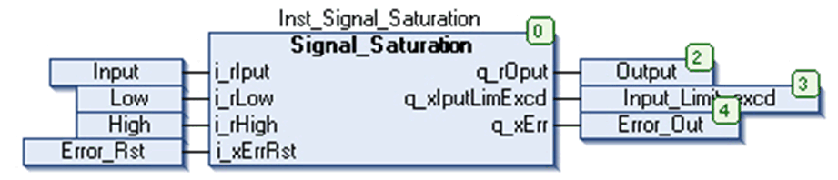
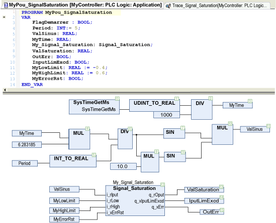
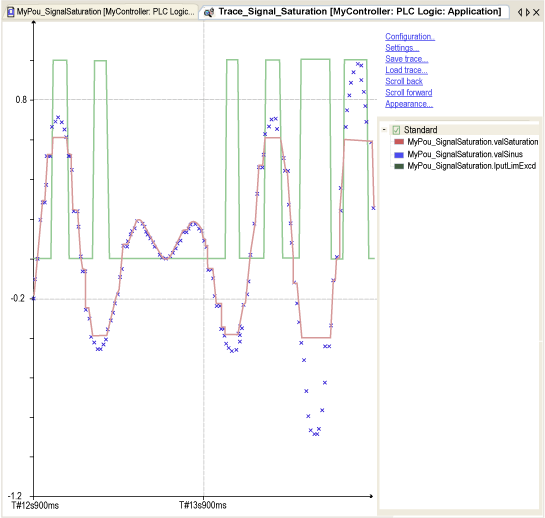
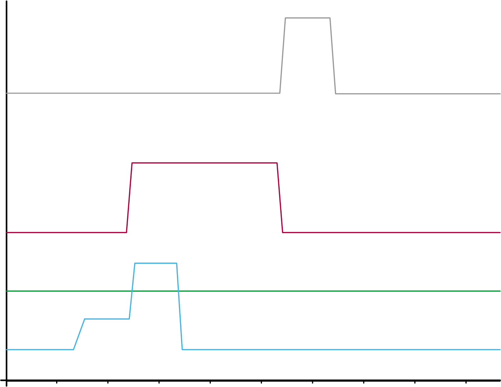

# `Signal_Saturation` Function Block

## Pin Diagram

This figure shows the pin diagram of the `Signal_Saturation` function block:

## Functional Description

The `Signal_Saturation` function block limits the input signal to upper and lower saturation limit.

When low input value is more than the high value then the detected error output is TRUE and the output displays zero.

When the input exceeds the low/high input limit value, then `q_xIputLimExcd` is TRUE.

## Input Pin Description

This table describes the input pins of the `Signal_Saturation` function block:

| Input | Data Type | Description |
| --- | --- | --- |
| `i_rIput` | `REAL` | Input value  Range: ±3.4e+38 |
| `i_rLow` | `REAL` | Lower input value  Range: ±3.4e+38 |
| `i_rHigh` | `REAL` | Higher input value  Range: ±3.4e+38 |
| `i_xErrRst` | `BOOL` | Reset the detected error. (On rising edge)  (Optional) |

## Output Pin Description

This table describes the output pins of the `Signal_Saturation` function block:

| Output | Data Type | Description |
| --- | --- | --- |
| `q_rOput` | `REAL` | Output value ±3.4e+38 |
| `q_xIputLimExcd` | `BOOL` | TRUE: Input value exceed limit value. |
| `q_xErr` | `BOOL` | TRUE: Input limit wrong  FALSE: No detected error |

## Instantiation and Usage Example

This figure shows an instance of the `Signal_Saturation` function block:

If input `i_rIput` is set to 4, `i_rLow` is set to 5 and `i_rHigh` is set to 10, then saturation output `i_rLow` value is 5 & `q_xIputLimExcd` is TRUE.

## CFC Example

This figure shows the CFC example on `Signal_Saturation` implementation:

## Timing Diagram

This figure shows the timing diagram for the `Signal_Saturation` function block:

**Blue** input signal

**Red** output signal, limited in the range [Low ; High]/[-0,4 ; +0,6].

**Green** `IputLimExcd`, TRUE when the input signal is out of the range.

This figure shows the timing diagram of `q_xErr` output:

**Blue:** `i_rLow` input signal

**Green:** `i_rHigh` input signal

**Red:** `q_xErr` output signal, TRUE as soon as `i_rLow` is higher than `i_rHigh`.

**Gray:** `i_xErrRst` input signal, reset the `q_xErr` output signal on rising edge while `i_rLow` is lower than `i_rHigh`.

EIO0000000096.09