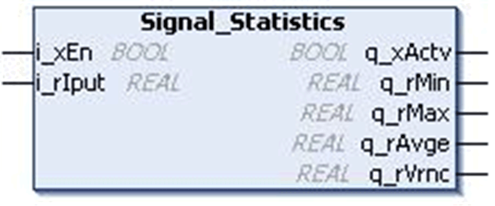
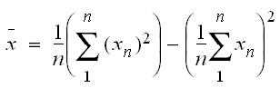

# `Signal_Statistics` Function Block

## Pin Diagram

This figure shows the pin diagram of the `Signal_Statistics` function block:

## Functional Description

This function block calculates the maximum, minimum, average and variance of a series of input values.

This function block considers the input value in each controller scan cycle as a Sample.

## Minimum Value

Minimum Output value is the value which is minimum amongst all the recorded samples.

## Maximum value

Maximum Output value is the value which is maximum amongst all the recorded samples.

## Average Value

The average value is equal to the sum of the observations (samples) divided by the number of observations (samples).

Where:

* n = Number of samples recorded
* Xn = Input samples
*  = Calculated output

## Variance Value

The variance is equal to the mean of the squares of samples minus the square of the mean (Average output value).

Where:

* n = Number of samples recorded
* Xn = Input samples
*  = Calculated output

## Example

* Statistics (Enable: = TRUE, Input: = 1, 2
* Minimum Output =1
* Maximum Output = 2
* Average = (1 + 2) / 2 = 1.5
* Variance = ((1 \* 1 + 2 \* 2) / 2) - (1.5 \* 1.5) = 2.5 - 2.25 = 0.25

## Input Pin Description

This table describes the input pins of the `Signal_Statistics` function block:

| Input | Data Type | Description |
| --- | --- | --- |
| `i_xEn` | `BOOL` | TRUE: FB enabled  FALSE: FB Disabled |
| `i_rIput` | `REAL` | Bit position  Range: ±3.4e+38 |

## Output Pin Description

This table describes the output pins of the `Signal_Statistics` function block:

| output | Data Type | Description |
| --- | --- | --- |
| `q_xActv` | `BOOL` | FB status output |
| `q_rMin` | `REAL` | Minimum value  Range: ±3.4e+38 |
| `q_rMax` | `REAL` | Maximum value  Range: ±3.4e+38 |
| `q_rAvge` | `REAL` | Average value  Range: ±3.4e+38 |
| `q_rVrnc` | `REAL` | Variance value  Range: ±3.4e+38 |

EIO0000000096.09