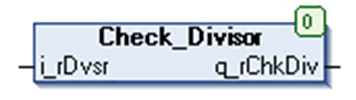

# `Check_Divisor` Function Block

## Pin Diagram

This figure shows the pin diagram of the `Check_Divisor` function block:

## Functional Description

The `Check_Divisor` function block checks for zero division condition.

If the divisor `i_rDvsr` is zero, then the output `q_rChkDiv` is 1, else if divisor not equal to 0, then output is equal to divisor.

## Input Pin Description

This table describes the input pins of the `Check_Divisor` function block:

| Input | Data Type | Description |
| --- | --- | --- |
| `i_rDvsr` | `REAL` | Divisor output  Range: ±3.4e+38 |

## Output Pin Description

This table describes the output pins of the `Check_Divisor` function block:

| output | Data Type | Description |
| --- | --- | --- |
| `q_rChkDiv` | `REAL` | Check division output  Range: ±3.4e+38  NOTE: This output is not valid at the value 0. |

EIO0000000096.09