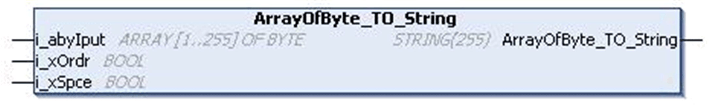
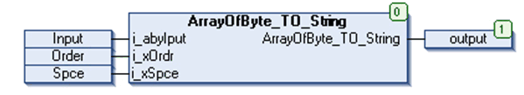

# `ArrayOfByte_TO_String` Function

## Pin Diagram

This figure shows the pin diagram of the `ArrayOfByte_TO_String` function:

## Functional Description

The output String [255] is the set of string characters which corresponds to the ASCII value of input array given in Byte format.

If Order input is TRUE, then the order of characters in the output string corresponds to the order of bytes at the input array. This means there is a 1:1 correspondence between order of input bytes and order of string characters returned at output as explained in example 1.

If the Order input is FALSE, then the order of characters in the output string will be such that, the string character corresponding to ASCII value at input[1] is displayed in output position[2] of output[1..255]. The string character corresponding to ASCII value at input[2] will be displayed in output position[1] of output[1..255].

Similarly the string character corresponding to ASCII value at input[3] will be displayed in output position[4] of output[1..255]. The string character corresponding to ASCII value at input[4] will be displayed in output position[3] of output[1..255] as explained in example 2.

Only if Order input is FALSE and Space input is TRUE and the number of input bytes at the input is odd, then a space character will be added prior to the last string character of the output string as shown in example 3 and 4.

But if the Order input is TRUE, then the Space input has no impact on the output as shown in example 6.

## Example 1

Input: ARRAY [1..255] OF BYTE = 72, 69, 76, 76, 79;

Order: TRUE

Space: FALSE

String: 'HELLO'

As shown above, the order of characters in the output string corresponds to the order of input bytes, that is the byte value at the first position of Array[1..255] is 72 which corresponds to the string value at the first position of the output which is H. The byte value at second position of Array[1..255] is 69 which corresponds to string value at second position of the output which is E and so on.

## Example 2

Input: ARRAY [1..255] OF BYTE = 65, 66, 67, 68, 69, 70, 71;

ByteOrder: FALSE

InsertSpace: FALSE

String: ‘BADCFEG’

As shown above, the order of characters in the output string is changed, that is the byte value at first position of Array [1...255] is 65 which corresponds to the string value at second position of the output which is A. The byte value at second position of Array[1..255] is 66 which corresponds to the string value at first position of the output which is B. Similarly the byte value at third position of Array[1..255] is 67 which corresponds to the string value at fourth position of the output which is C. The byte value at fourth position of Array[1..255] is 68 corresponds to the string value at third position of the output which is D and so on.

## Example 3

Input: ARRAY [1..255] OF BYTE = 72, 69, 76, 76, 79;

Order: FALSE

Space: TRUE

String: ‘EHLL O’

## Example 4

Input: ARRAY [1..255] OF BYTE = 65, 66, 67, 68, 69, 70, 71;

Order: FALSE

Space: TRUE

String: ‘BADCFE G’

As shown above in examples 3 & 4, the number of inputs is 5 in example 3 and 7 in example 4. Since 5 and 7 are odd numbers, the Order input is FALSE and Space input is TRUE. Hence the string outputs are 'EHLL O' AND 'BADCFE G' respectively.

NOTE: However if the number of bytes at the input are 255, Order input is FALSE and Space input is TRUE. The Space input becomes insignificant as explained in example 5 below.

## Example 5

Input: ARRAY [1..250] OF BYTE = 65 and ARRAY [251..255] OF BYTE = 66, 67, 68, 69, 70;

Order: TRUE

Space: TRUE/FALSE

String[1..250]: 'A' and String[251..255] = ‘CBEDF’

As shown in the above example, if the number of bytes at the input is 255, the string output remains unaffected by the Space input

## Example 6

Input: ARRAY [1..255] OF BYTE = 65, 66, 67, 68, 69, 70, 71;

Order: TRUE

Space: TRUE

String: ‘ABCDEFG’

As shown above, if the Order input is TRUE, the space input becomes insignificant.

## Input Pin Description

This table describes the input pins of the `ArrayOfByte_TO_String` function:

| Input | Data Type | Description |
| --- | --- | --- |
| `i_abyIput` | `ARRAY [1..255] OF BYTE` | Input value  Range: 1...255 |
| `i_xOrdr` | `BOOL` | TRUE: In order of input  FALSE: Swaps higher and lower byte |
| `i_xSpce` | `BOOL` | TRUE: Inserts space when `i_xOrdr` is low  FALSE: No space is inserted. |

NOTE: `I_xSpce` will insert a space character just before the last output string character when the Order input is FALSE and the number of input bytes is odd.

## Output Pin Description

This table describes the output pins of the `ArrayOfByte_TO_String` function:

| Output | Data Type | Description |
| --- | --- | --- |
| `ArrayOfByte_TO_String` | `STRING(255)` | Output of string characters |

NOTE: It is mandatory for the user to define the size of the string output as [255], else the size is taken as 80 by default.

## Instantiation and Usage Example

This figure shows an instance of the `ArrayOfByte_TO_String` function:

## With Order Input and Without Space Input

If input is:

* `i_abyIput` [255]

  + Input [1] = 65
  + Input [2] = 66
  + Input [3] = 67
  + Input [4] = 68
  + Input [5] = 69
* `i_xOrdr`: TRUE
* `i_xSpce`: FALSE

The `ArrayOfByte_TO_String` displays ‘ABCDE’.

## With Order Input and With Space Input

If input is:

* `i_abyIput` [255]

  + Input [1] = 65
  + Input [2] = 66
  + Input [3] = 67
  + Input [4] = 68
  + Input [5] = 69
* `i_xOrdr`: FALSE
* `i_xSpce`: TRUE

The `ArrayOfByte_TO_String` displays ‘BADC E’

EIO0000000096.09