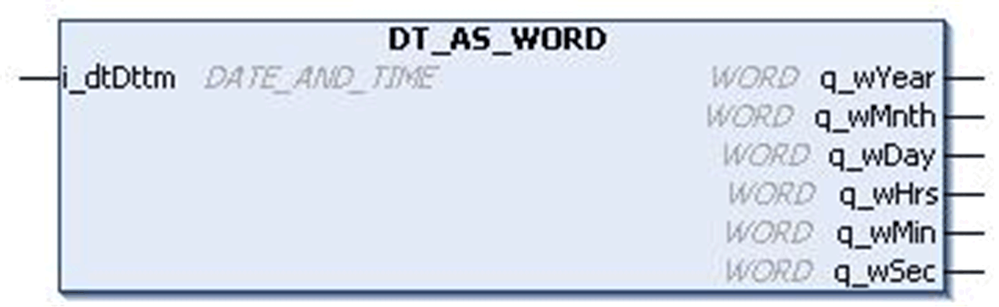
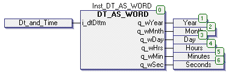

# `DT_AS_WORD` Function Block

## Pin Diagram

This figure shows the pin diagram of the `DT_AS_WORD` function block:

## Functional Description

The `DT_AS_WORD` function block extracts data from date and converts to equivalent words.

The `DATE_AND_TIME` input is converted to output in the form of `WORD` having year, month, date, hour, minute and second separately.

## Example

With the input DT#2008-08-15-11:05:30, outputs are:

* Output year: 2008
* Output month: 8
* Output day: 15
* Output hours: 11
* Output minutes: 5
* Output seconds: 30

## Input Pin Description

This table describes the input pins of the `DT_AS_WORD` function block:

| Input | Data Type | Description |
| --- | --- | --- |
| `i_dtDttm` | `DT` | Date and time input  Range: 1970-01-01-00:00:00...  2106-02-07-06:28:15 |

## Output Pin Description

This table describes the output pins of the `DT_AS_WORD` function block:

| Output | Data Type | Description |
| --- | --- | --- |
| `q_wYear` | `WORD` | Year output  Range: 1970...2106 |
| `q_wMnth` | `WORD` | Month output  Range: 1...12 |
| `q_wDay` | `WORD` | Date output  Range: 1...31 |
| `q_wHrs` | `WORD` | Hours output  Range: 1...23 |
| `q_wMin` | `WORD` | Minutes output  Range: 1...59 |
| `q_wSec` | `WORD` | Seconds output  Range: 1...59 |

## Instantiation and Usage Example

This figure shows an instance of the `DT_AS_WORD` function block:

Operation of the function block is given in the below example:

* `i_dtDttm`: DT#2008-08-15-11:05:30
* `q_wYear`: 2008
* `q_wMnth`: 8
* `q_wDay`: 15
* `q_wHrs`: 11
* `q_wMin`: 5
* `q_wSec`: 30

EIO0000000096.09